# Documentação IoT - Módulo 4 - Inteli

## JinWar

#### <a href="https://www.linkedin.com/in/drielly-farias/">Drielly Farias</a>, <a href="https://www.linkedin.com/in/diogo-pelaes-a34593279/">Diogo Burgierman</a>, <a href="https://www.linkedin.com/in/eduardo-hos/">Eduardo Henrique Oliveira Santos</a>, <a href="https://www.linkedin.com/in/enzo-bressane-72a030219/">Enzo Bressane</a>, <a href="https://www.linkedin.com/in/isabelle-beatriz-vasquez-oliveira-55a19626a/">Isabelle Vasquez</a>, <a href="https://www.linkedin.com/in/ricardo-novaes-24276b271/">Ricardo B Novaes</a>


## Sumário

[1. Introdução](#c1)

[2. Metodologia](#c2)

[3. Desenvolvimento e Resultados](#c3)

[4. Possibilidades de Descarte](#c4)

[5. Conclusões e Recomendações](#c5)

[6. Referências](#c6)

<br>

# <a name="c1"></a>1. Introdução

&emsp;&emsp;Este texto descreve o contexto, desenvolvimento e evolução do projeto do grupo JinWar, o qual visa coletar, organizar e fornecer a localização de pessoas dentro do ambiente do hospital Sírio Libanês. Além de questões técnicas, são apresentadas também informações sobre a análise de negócios da empresa.

&emsp;&emsp;O hospital Sírio-Libanês começou em 1921 com um grupo de mulheres e, ao longo de mais de um século, se consolidou como hospital de referência. Atualmente é uma instituição de grande porte, com atuação na área de saúde e inovação médica, com unidades em São Paulo e Brasília.

&emsp;&emsp;A Alma Sírio-Libanês, uma divisão do Hospital Sírio Libanês com foco em tecnologia e inovação, propôs o desenvolvimento de uma solução baseada em IoT, para coletar e fornecer a localização da equipe assistencial e dos pacientes, a fim de alocar atividades e funcionários com maior eficiência. O grupo JinWar pretende solucionar a questão usando componentes de hardware e a linguagem de programação C++.

&emsp;&emsp;O grupo Jinwar¹, o qual realizou esse projeto, escolheu esse nome para representá-los por significar de acordo com uma tradução livre do dialeto curdo, kurmanji, “o espaço de vida”. Além disso, esse é o mesmo nome de uma cidade só de mulheres e crianças que busca se afastar dos conflitos.

&emsp;&emsp;A cidade é uma forma de manifestação e resposta a violência de homens jugos em conflitos na Síria. Como o Sirio-Libanês foi uma forma de gratidão de mulheres sirio-libanesas ao que a cidade de São Paulo proporcionou a elas, e que até hoje acolhe pessoas, Jinwar também é uma manifestação de acolhimento a essas famílias de mulheres que buscam se erguer com seus filhos no meio de um grande ato de sororidade. O grupo Jinwar compartilha desse mesmo espírito e busca criar um ambiente seguro, onde os indivíduos possam recorrer para cuidar de sua saúde e bem-estar.

## 1.1 Objetivos

&emsp;&emsp;O hospital deseja como objetivo geral otimizar a alocação da equipe assistencial e dos pacientes nos locais de pronto-atendimento. Desse modo, pretende-se criar um dispositivo wearable capaz de informar a localização de profissionais, com foco na equipe de enfermagem, médicos e fisioterapeutas mais próximos do paciente que precisa de assistência, de forma rápida e eficiente. Sendo mais específico, a localização poderá ser feita por meio de um crachá que auxiliaria na otimização. O dispositivo também permitirá ter uma visão macro da localização da equipe do hospital no Pronto Atendimento (PA), para então priorizar e reordenar os demais tipos de atendimentos, como consultas e exames.

## 1.2 Proposta da solução

&emsp;&emsp;A solução para o problema descrito será um sistema com o uso de uma tag com RFID (Radio Frequency Identification), usando uma placa Arduino EESP 32, um kit RFID-RC522 e uma interface para visualização dos dados coletados.
Esses componentes de hardware serão integrados usando a linguagem de programação C++ e C.

## 1.3 Justificativa

&emsp;&emsp;O sistema Jinwar otimiza o atendimento e dinâmica diária no hospital ao acelerar a troca de informações entre equipes e centralizar as informações de localização disponíveis em um único lugar. A agilidade que o Jinwar proporciona permite direcionar o fluxo de atendimento do paciente e diminuir o tempo de resposta por parte da equipe médica. Além disso, possui baixo custo de implementação. O foco macro do projeto visa conseguir preservar a vida. Com os benefícios que esse projeto traz, o Hospital Sirio-Libanês, com a sua vertical de inovação Alma - Sirio-Libanês poderá ser uma solução única feita pensada para auxiliar a equipe médica que precisa ser objetiva no atendimento. Pontos como o estacionamento do hospital não são passíveis de obter a localização precisa sobre onde o paciente está ou sobre onde a equipe do hospital está para auxiliar. Com essa solução, esse tipo de problema, caso venha a acontecer, não terá empecilhos por falta de alcance.

# <a name="c2"></a>2. Metodologia

&emsp;&emsp;O Modelo de Referência para Arquitetura Orientada a Objeto, ou RM-ODP (Reference Model for Open Distributed Processing) é um framework padronizado que define uma abordagem para o design de sistemas complexos, como projetos de IoT em grande escala. Ele foca em aspectos como estrutura, comportamento e interações entre diferentes partes de um sistema. O RM-ODP destaca-se por sua abordagem abrangente e flexível na descrição de arquiteturas de sistemas. Sua padronização, aceita por organizações de referência, promove a consistência e interoperabilidade em ambientes que adotam esse modelo. Além disso, o modelo é especialmente adequado para a programação orientada a objetos, sendo uma escolha ideal para projetos de IoT.

&emsp;&emsp;Na execução de cada etapa da metodologia aplicada, é fundamental evidenciar os seguintes pontos:

- **Ponto de Vista da Empresa:** Foca na identificação dos requisitos do negócio, objetivos, e políticas organizacionais. Esta etapa é crucial para compreender o contexto dentro do qual o sistema irá operar e os objetivos que ele visa atingir. Neste ponto, definimos a proposta de solução seguindo os objetivos da instituição e as prioridades do cliente. A análise feita para decidir esses pontos foi feita a partir de análises de negócios como Canvas Proposta de Valor, Análise SWOT, 5 Forças de Porter e Matriz de Riscos, com o objetivo de entender como a solução vai impactar nos processos do hospital e as melhores formas de otimizar os mesmos.

- **Ponto de Vista da Informação:** Concentra-se na estrutura e no fluxo de informações dentro do sistema. Esta etapa envolve a modelagem dos tipos de dados que o sistema irá processar, bem como as regras e restrições sobre esses dados. Para isso, o grupo buscou entender como os dados são distribuídos atualmente e como será esse fluxo de informações na solução. Essa análise envolveu coletar informações sobre requisitos para a gestão de informação, estrutura de dados e interface.

- **Ponto de Vista da Computação:** Esta etapa aborda a funcionalidade do sistema, definindo os componentes de software que irão realizar as operações e processos necessários. Inclui a modelagem das interfaces e a interação entre os componentes se software e hardware. Para isso, definimos os componentes de hardware essenciais e como o ESP32, sensores de RFID e Tokens de RFID, além de outros componentes relacionados aos mesmos. Por outro lado, entre os componentes de software essenciais estão o uso do protocolo de comunicação MQTT para possibilitar a comunicação e alta velocidade de resposta entre os componentes da solução.

- **Ponto de Vista da Engenharia:** Foca na infraestrutura necessária para suportar a distribuição do sistema. Esta etapa lida com a arquitetura do sistema em termos de componentes de software e hardware, comunicação de rede, e mecanismos de controle e gerenciamento. No desenvolvimento do projeto, o grupo definiu os componentes de hardware na seção de Bill Of Materials e definiu o Ubdots como uma plataforma necessária para realizar a comunicação de rede entre os componentes físicos e o software já que a plataforma Ubidots proporciona uma integração rápida, possibilitando uma interação com a solução por meio de uma interface de forma prática. Além disso, foram definidas abordagens para o desenvolvimento e implementação, incorporando as particularidades da solução sugerida.

- **Ponto de Vista da Tecnologia:** Esta etapa envolve a seleção de tecnologias específicas, ferramentas e plataformas que serão utilizadas na implementação do sistema. Inclui a escolha de linguagens de programação, sistemas de banco de dados, hardware, e outras tecnologias relevantes. No caso do projeto desenvolvido pelo grupo Jinwar, foram selecionadas tecnologias como o ESP32, RFID, MQTT que serão implementadas por outros componentes de hardware e por códigos desenvolvidos na linguagem C++. Para realizar essa decisão, foi analisada a viabilidade de infraestruturas de redes e as melhores opções de protocolos de comunicação, pensando tanto na funcionalidade quanto na segurança no contexto de localização de pessoas em um ambiente hospitalar.

&emsp;&emsp;Esses cinco pontos de vista da **RM-ODP** oferecem uma estrutura abrangente para o planejamento e design de sistemas distribuídos, assegurando que todos os aspectos críticos, desde os objetivos de negócios até as escolhas tecnológicas, sejam cuidadosamente considerados e integrados.

&emsp;&emsp;É crucial ressaltar que este modelo é independente de tecnologia. As descrições de arquitetura no RM-ODP são conceituais e não estão vinculadas a tecnologias específicas, o que favorece a adaptabilidade do sistema ao longo do tempo. Todos esses motivos levaram o grupo Jimwar a adotar o modelo RM-ODP no desenvolvimento da solução IoT para o Hospital Sírio-Libanês.

# <a name="c3"></a>3. Desenvolvimento e Resultados

&emsp;&emsp; Nesta seção, encontra-se o registro de desenvolvimento do projeto, documentando as informações sobre a análise de negócios, sobre o design da experiência do usuário e os resultados obtidos a partir desse estudo juntamente com a aplicação dos conhecimentos técnicos.

## 3.1. Domínio de Fundamentos de Negócio

&emsp;&emsp;Nesta seção, busca-se entender qual é o contexto do projeto e da indústria, onde Alma Sirio Libanes se situa no mercado, apresentando a solução, seus pontos que agregam valor, no que ela se diferencia, buscando ter uma visão micro e ao mesmo tempo macro do parceiro e da solução. Dessa maneira, a solução Jinwar poderá ser construída com mais segurança, se preparando para eventuais problemas, oportunidades, e até mesmo, para como serão tratados os dados dos pacientes e equipe do hospital.

### 3.1.1. Contexto da Indústria

&emsp;&emsp;Nos últimos anos, a indústria de saúde no Brasil tem passado por grandes transformações, tanto no que se refere à inovação tecnológica quanto na redefinição do foco do atendimento, ao mesmo tempo em que enfrenta desafios constantes relacionados às regulamentações governamentais.

&emsp;&emsp;É inegável que a indústria de hospitais particulares no Brasil tem experimentado um notável crescimento, o que gera uma competição acirrada entre as principais empresas do setor e uma busca crescente por vantagens competitivas. No cenário atual, a inovação tecnológica se tornou o pilar central dessa expansão, implicando a necessidade de mais investimentos e pesquisas por parte de hospitais renomados, como o Hospital Sírio-Libanês. Isso ocorre porque a adoção de novas tecnologias em ambientes de alto risco, que têm um impacto direto na saúde das pessoas, requer padrões de qualidade excepcionais, sendo a vida tratada como ponto mais vultoso.

&emsp;&emsp;O setor de saúde no Brasil enfrenta desafios significativos relacionados a questões regulatórias, uma vez que esse sistema é altamente regulamentado, com normas que variam desde a construção e operação de hospitais até as diretrizes para a prática médica e aquisição de equipamentos. Além disso, o financiamento da saúde no Brasil é um desafio constante. Os hospitais particulares dependem em grande parte de receitas provenientes de planos de saúde, que nem sempre são suficientes para cobrir os crescentes custos dos serviços médicos². É importante ressaltar que o sistema de saúde pública, o Sistema Único de Saúde (SUS), enfrenta limitações orçamentárias, o que pode aumentar a pressão sobre o setor privado para atender às necessidades de saúde da população.

&emsp;&emsp;Em um país de grande extensão territorial, com uma desigualdade social tão significativa como o Brasil, esse mesmo cenário se reflete na prestação de serviços de saúde. Enquanto as grandes cidades e áreas urbanas tendem a ter hospitais bem equipados e serviços de alta qualidade, as áreas rurais e regiões mais remotas frequentemente enfrentam carências de infraestrutura médica e escassez de profissionais de saúde. Essa desigualdade pode sobrecarregar hospitais particulares em áreas de maior demanda e pressionar ainda mais o sistema de saúde, até mesmo por questões governamentais reguladas, como a obrigatoriedade dos hospitais privados de prestar serviço emergencial ², caso contrário é considerado crime.

&emsp;&emsp;Nesse cenário de constantes mudanças, o setor de saúde privado enfrenta a responsabilidade de fornecer serviços de alta qualidade, promover a equidade no acesso e desempenhar um papel crucial na construção de um sistema de saúde mais robusto e acessível para toda a população brasileira.

#### 3.1.1.1. Cinco Forças Poter

&emsp;&emsp;Na contextualização da indústria, a análise das 5 Forças de Porter³ é de suma importância, sendo um modelo fundamental para compreender a competitividade de um mercado. Desenvolvido por Michael Porter na década de 1970, esse framework é amplamente utilizado na administração, auxiliando as empresas na elaboração de estratégias eficazes que consideram o modelo de negócios. O modelo se concentra em cinco forças-chave que moldam um setor de negócios: a rivalidade entre concorrentes, o poder de barganha dos fornecedores, o poder de barganha dos compradores, a ameaça de novos entrantes e a ameaça de produtos ou serviços substitutos. Cada uma dessas forças desempenha um papel significativo na determinação do sucesso e da lucratividade de um negócio. Portanto, compreender e aplicar as 5 Forças de Porter é essencial para o planejamento estratégico, como evidenciado no projeto Jinwar, onde se esquematizou as 5 forças em relação à digitalização no setor de saúde, visando posicionar o Alma Sírio-Libanês de maneira competitiva no mercado em constante evolução.

<div align="center">
  <p> <b>Figura 01</b> - Cinco Forças Porter 1 </p>
  
  <p><b>Fonte:</b> elaboração por Jinwar.</p>
</div>

<div align="center">
  <p> <b>Quadro 01</b> - Cinco Forças Porter 2 </p>

| Forças                            | Quem são                                                                                                                                                                       | Quais ameaças                                                                                                                                                                                                                                                                                                                                                                                                                                                                                                                                                                                                                                                                                                                                                                                                                                                                                                                                                                                  | Quais as minhas reações possíveis                                                                      |
| --------------------------------- | ------------------------------------------------------------------------------------------------------------------------------------------------------------------------------ | ---------------------------------------------------------------------------------------------------------------------------------------------------------------------------------------------------------------------------------------------------------------------------------------------------------------------------------------------------------------------------------------------------------------------------------------------------------------------------------------------------------------------------------------------------------------------------------------------------------------------------------------------------------------------------------------------------------------------------------------------------------------------------------------------------------------------------------------------------------------------------------------------------------------------------------------------------------------------------------------------- | ------------------------------------------------------------------------------------------------------ |
| **F1 - Concorrentes atuais**      | Hospital Albert Einstein, Hospital Samaritano Paulista, Hospital Alemão Oswaldo Cruz, Hospital Beneficência Portuguesa                                                         | **Hospital Israelita Albert Einstein:** possui vários projetos envolvendo soluções de saúde digital e tecnologia para suporte ao paciente e ao médico, juntamente com a gestão do fluxo de pacientes no ambiente de emergência; Hospital Samaritano Paulista: tem se empenhado na implementação de fluxos de dados e processos uniformes, com foco em emergência; **Hospital Alemão Oswaldo Cruz:** implementou a tecnologia IoT para monitoramento de temperatura e umidade. Há também menção a um projeto de Inteligência de Negócios para melhorar a análise de dados, e o hospital abriga um Centro de Inovação e Educação possivelmente envolvido em projetos sobre emergência via IoT; **Hospital Beneficência Portuguesa:** participou de um Projeto Lean focado na gestão de fluxo de processos em vários departamentos, incluindo o departamento de emergência. Além disso, um projeto de videomonitoramento foi mencionado, mas não foram fornecidos detalhes específicos sobre IoT. | Priorizar inovação e pesquisa, buscar padrões superiores de atendimento e melhorar a tecnologia.       |
| **F2 - Conconrrentes Potenciais** | Startups e empresas emergentes no setor de tecnologia da saúde, Centro de Inovação Tecnológica (CIT) - Albert Einstein, Hospital das clinicas de São Paulo, Hospital São Luiz. | **Health Innovation Techcenter (HIT):** pode estar envolvido em projetos de inovação que também visam melhorar a eficiência e a qualidade dos serviços hospitalares, incluindo soluções de IoT para saúde; **Hospital das Clínicas de São Paulo:** implementou a tecnologia 5G, permitindo avanços em diversas áreas, incluindo a saúde. Esta tecnologia pode servir como uma base para a implementação de soluções IoT para gestão de fluxo de pacientes; **Hospital São Luiz:** possui uma infraestrutura equipada com tecnologia de ponta, indicando uma possível inclinação para a implementação de soluções tecnológicas avançadas, como IoT, para gestão de fluxo de pacientes.                                                                                                                                                                                                                                                                                                          | Fomentar parcerias estratégicas, manter-se atualizado sobre inovações e expandir a oferta de soluções. |
| **F3 - Produtos substitutos**     | Tecnologias de saúde alternativas, Soluções de home care, Smart Watches.                                                                                                       | Deslocamento do foco do ambiente hospitalar tradicional; solução não centrada no corpo hospitalar.                                                                                                                                                                                                                                                                                                                                                                                                                                                                                                                                                                                                                                                                                                                                                                                                                                                                                             | Diversificar portfólio, integrar soluções de home care e aprimorar o atendimento virtual.              |
| **F4 - Fornecedores**             | Empresas que fornecem tecnologias avançadas, materiais e softwares para o Alma Sírio-Libanês, WJ Componentes Eletrônicos, MakerHero.                                           | Dependência de tecnologias específicas ou escassez de materiais, Precificação alta por demanda.                                                                                                                                                                                                                                                                                                                                                                                                                                                                                                                                                                                                                                                                                                                                                                                                                                                                                                | Criar acordos estratégicos, explorar novos parceiros tecnológicos e otimizar processos de compra.      |
| **F5 - Clientes**                 | **Pacientes do Hospital Sírio-Libanês**: pessoas de classe média a alta, com condição de pagar a mensalidade;                                                                  | Falta de fidelidade na contratação do serviço de saúde.                                                                                                                                                                                                                                                                                                                                                                                                                                                                                                                                                                                                                                                                                                                                                                                                                                                                                         | Oferecer diferentes planos, que se adequem às necessidades de cada perfil.                             |

  <p><b>Fonte:</b> elaboração por Jinwar.</p>
</div>

&emsp;&emsp;Ao avaliar o cenário em que o Alma Sírio-Libanês está inserido, torna-se evidente a necessidade de uma estratégia dinâmica e proativa para enfrentar os desafios emergentes. A combinação de concorrência acirrada, evolução tecnológica e expectativas elevadas dos clientes exige uma postura inovadora e centrada no usuário. O futuro do setor de saúde é digital, e o "Alma Sírio-Libanês" está, sem dúvida, na vanguarda dessa transformação. Analisando o contexto, o Hospital Sírio-Libanês deve considerar a concorrência atual, como o Hospital Albert Einstein, Samaritano Paulista, Alemão Oswaldo Cruz e Beneficência Portuguesa como os maiores concorrentes. As ameaças incluem o avanço tecnológico e a busca por inovação desses concorrentes, levando o Sírio-Libanês a reagir com aprimoramento em soluções de saúde digital e gestão de fluxo de pacientes.

&emsp;&emsp;Ademais, os concorrentes potenciais, como startups e instituições como o Hospital das Clínicas de São Paulo, representam a introdução rápida de novas tecnologias no mercado, exigindo que o Sírio-Libanês fomente parcerias estratégicas e esteja atualizado sobre inovações.

&emsp;&emsp;A ameaça dos produtos substitutos, como tecnologias alternativas e soluções de home care, requer a diversificação do portfólio e a integração de soluções de home care para manter o foco no ambiente hospitalar tradicional.

&emsp;&emsp;Os fornecedores, incluindo empresas de tecnologia e materiais, podem apresentar desafios de dependência e precificação. Portanto, o Sírio-Libanês deve buscar acordos estratégicos, para explorar novos parceiros e otimizar processos de compra.

&emsp;&emsp;Por fim, as expectativas crescentes dos pacientes e a demanda por soluções personalizadas e eficientes destacam a necessidade de melhorar o atendimento e adaptar-se às necessidades do cliente, visando fornecer um atendimento premium. A todo modo é perceptível que a solução que se trata, Jinwar, para o Hospital Sirio-Libanes é única, o que proporciona o desenvolvimento de um mercado original. No mundo dos negócios, esse mercado é chamado de Oceano Azul.

### 3.1.2. Análise SWOT

&emsp;&emsp;A Matriz SWOT⁴, conforme descrita por Albert Humphrey⁵, é uma ferramenta visual de análise utilizada para identificar pontos fortes e fracos em cenários tanto pessoais quanto profissionais. Seu propósito principal é facilitar a tomada de decisões e o planejamento futuro. Essa matriz aborda aspectos específicos de uma organização, englobando suas Forças (Strengths - S), Fraquezas (Weaknesses - W), Oportunidades (Opportunities - O) e Ameaças (Threats - T), conforme as siglas em inglês.

&emsp;&emsp;A Matriz SWOT é aplicada quando gestores buscam uma compreensão mais ampla dos fatores que podem influenciar o rumo de suas trajetórias. Ela auxilia na identificação de recursos já disponíveis e fornece uma visão mais clara das dificuldades e desafios que podem surgir no horizonte. Dessa forma, as organizações conseguem avaliar com precisão suas competências e áreas de aprimoramento, bem como tomar decisões estratégicas para aprimorar sua posição competitiva e alcançar os objetivos de negócios estabelecidos.

<div align="center">
  <p> <b>Figura 02 </b> - Análise SWOT</p>
  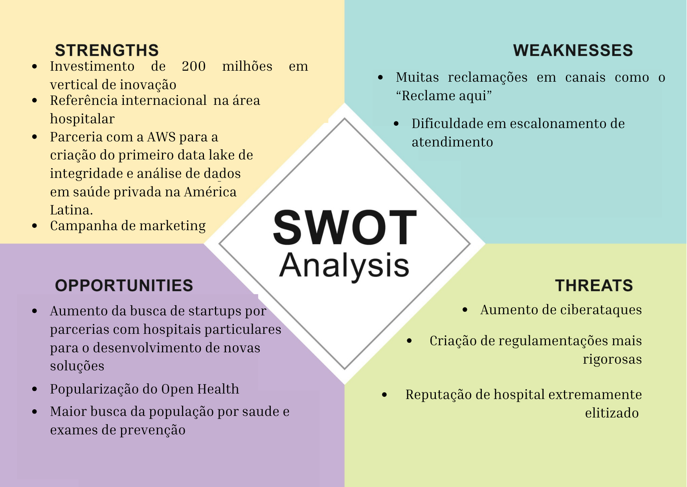
  <p><b>Fonte:</b> elaboração própria</p>
</div>

&emsp;&emsp;Ao realizar a análise SWOT, é necessária a avaliação de diversos aspectos relacionados à empresa em questão. O Hospital Sírio-Libanês se destaca no quesito de forças, pois a empresa tem investido significativamente em inovação e tecnologia, como a nova vertical de inovação, tecnologia e dados em saúde chamada Alma Sírio-Libanês. O Hospital Sírio-Libanês é classificado como o segundo melhor hospital do Brasil e o 104º melhor hospital do mundo. Além disso, nos últimos meses, estabeleceu uma parceria com a AWS (Amazon Web Services) para desenvolver o primeiro data lake de integridade e análise de dados em saúde privada na América Latina.

&emsp;&emsp;Por outro lado, a integração do hospital com tecnologias modernas o torna mais suscetível a ciberataques, uma vez que as infraestruturas digitais expandem as superfícies de ataque. Isso é particularmente preocupante para organizações que lidam com dados altamente sensíveis, como as informações dos pacientes de um hospital.

&emsp;&emsp;Ademais, a crescente dependência de sistemas de registros médicos eletrônicos, dispositivos médicos conectados à Internet e a troca de informações de saúde via redes digitais aumenta as oportunidades para potenciais invasores explorarem vulnerabilidades. Diante disso, a segurança cibernética torna-se uma prioridade crítica para garantir a integridade e disponibilidade dos dados de saúde, bem como a continuidade dos serviços de cuidados de saúde. Portanto, os hospitais precisam implementar medidas rigorosas de proteção cibernética e estar preparados para enfrentar ameaças cada vez mais sofisticadas.

### 3.1.3. Descrição da Solução a ser Desenvolvida

&emsp;&emsp;O objetivo dessa seção é conseguir identificar o problema, a forma de se atuar em cima dele. Explicando a solução em seus detalhes e até mesmo critérios de avaliação da solução.

#### 3.1.3.1 Qual é o problema a ser resolvido

&emsp;&emsp;Hospitais costumam ter problemas com fluxo de pessoas e organização justamente por não saber em que fase de atendimento cada paciente está e quanto tempo está sendo gasto em cada uma delas. No caso de um hospital de grande porte,como o Hospital Sírio-Libanês, existe a necessidade de otimizar o atendimento e o fluxo de pessoas em áreas de urgências constantes como a unidade de pronto atendimento.

#### 3.1.3.2 Qual a solução proposta (visão de negócios)

&emsp;&emsp;A solução tem o objetivo principal de localizar cada paciente e cada colaborador da unidade de Pronto Atendimento, com foco na equipe de enfermagem, médicos e fisioterapeuta por meio de RFID (Radio Frequency Identification) integrado a um sistema que mostre o tempo médio que está sendo gasto em diferentes ambientes e fases de atendimento do Pronto Atendimento.

#### 3.1.3.3 Como a solução proposta deverá ser utilizada

&emsp;&emsp;A solução usada pelos pacientes será implementada por um adesivo que pode ser colocado tanto na pulseira de identificação do paciente quanto na região superior de uma camiseta, por exemplo. Esse adesivo será uma etiqueta RFID que vai transmitir dados para a antena mais próxima do paciente. A mesma tecnologia será utilizada pelos colaboradores do hospital, porém por uma questão de necessidades inegociáveis desses profissionais (como manter as mãos sempre higienizadas e evitar adereço nos pulsos/braços) os mesmos utilizaram um crachá similar a um cartão comum com o chip de RFID.

&emsp;&emsp;É importante se atentar que pode ser necessário instalar novas antenas e leitores de RFID caso não a distribuição de antenas do hospital não seja suficientemente precisa para o cliente, por isso é necessário já considerar isso como um gasto provável.

&emsp;&emsp;Após o leitor se conectar a antena e receber as informações do RFID do usuário, esses dados serão enviados para um computador com a base de dados RFID que vai armazenar e avaliar esses dados.

#### 3.1.3.4 Quais os benefícios trazidos pela solução proposta

&emsp;&emsp;Os principais benefícios providos pela solução que o grupo Jinwar envolvem são o baixo custo da implementação desse sistema e a precisão da localização de cada pessoa que estiver no ambiente hospitalar.

&emsp;&emsp;Além de otimizar o tempo e o fluxo de pessoas no ambiente, essa solução também proporciona mais segurança para os pacientes e colaboradores, já que você consegue identificar rapidamente a rota que cada pessoa fez e encontrá-la rapidamente em casos de emergência.

#### 3.1.3.5 Qual será o critério de sucesso e qual medida será utilizada para o avaliar

&emsp;&emsp;O sucesso da implementação de um dispositivo de rastreamento de localização em um pronto atendimento depende da precisão na localização, otimização do fluxo de pacientes e redução no tempo de atendimento e espera. Esses critérios se alinham com a necessidade de garantir que os pacientes recebam cuidados mais rápidos e eficazes, enquanto também avaliam a aceitação do dispositivo. A eficácia será avaliada por métricas quantitativas, como a redução no tempo de espera e aumento na eficiência operacional, bem como qualitativamente, por meio de pesquisas de feedback para medir a satisfação e confiança dos pacientes e acompanhantes em relação ao dispositivo.

### 3.1.4. Value Proposition Canvas

&emsp;&emsp;Traduzindo o nome para portugues, “Tela de Proposta de Valor” é um tipo de documento de negócios que faz parte de uma projeção mais complexa de um outro modelo, chamado Business Model Canvas, que auxilia na análise do negócio. Nele é feito uma análise do cliente observando seus ganhos, tarefas e dores, justamente pensando no produto que está sendo gerado, desenvolvendo os aliviadores de dor, qual o serviço que o produto proporciona e quais são os criadores de ganhos⁶. Dessa forma, é possível visualizar o diferencial da solução e garantir o sucesso do modelo IoT que está sendo desenvolvido. Dito isso, segue o Canvas Proposta de valor do projeto JinWar.

<div align="center">
  <p> <b>Figura 03</b> - Canvas Proposta de Valor</p>
  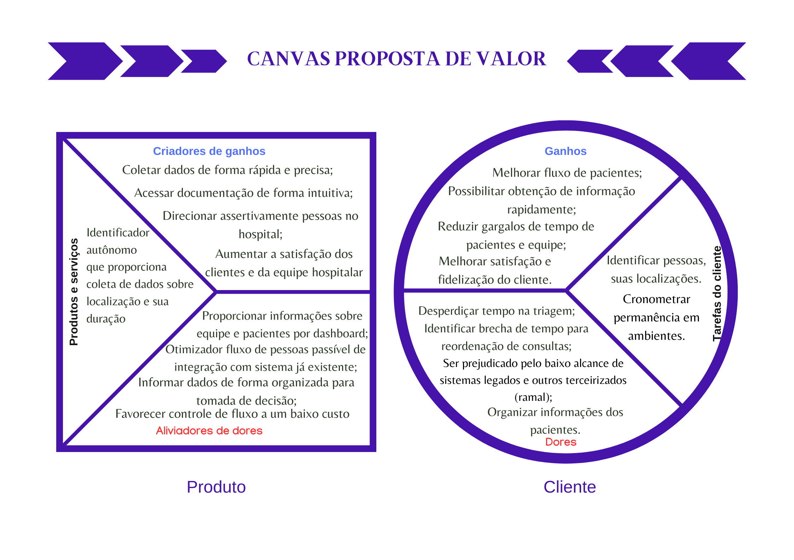
  <p><b>Fonte:</b> elaboração JinWar</p>
</div>

&emsp;&emsp;Analisando as imagens, vê-se como os títulos da mesma cor de produto e de cliente se relacionam. O cliente por exemplo possui a “dor” de prevenir o desperdício de tempo na triagem, como relatado em reunião com o cliente, um terço (⅓ ) do tempo do paciente é em triagem e burocracias até conseguir ser atendido. Para solucionar essa dor, há o “remédio” que o produto consegue fornecer otimizando o fluxo de pessoas dentro do hospital, através de uma dashboard informativa e organizada, facilitando a tomada de decisão. Existe os “ganhos” do cliente e os “criadores de ganhos” em produtos. Exemplificando novamente, no criador de "ganho"coletar dados de forma rápida e precisa proporciona o ganho de “possibilitar obtenção de informação rapidamente". E por último na “tarefa do cliente” existe a necessidade de identificar pessoas, suas localizações e cronometrar sua permanência em ambientes. Essa tarefa é atendida por meio de um identificador autônomo que proporciona coleta de dados sobre localização e sua duração. Seguindo essa lógica de leitura da imagem, é possível identificar o objetivo central desse Canvas Proposta de Valor, que é mostrar como o produto apresenta diferenciais que conseguem agregar valor ao cliente.

### 3.1.5. Matriz de Riscos

&emsp;&emsp;A matriz de risco⁷ é uma forma dinâmica de conseguir analisar quais são os riscos que cercam uma empresa/projeto, como a solução Jinwar. Ela é importante para conseguir gerir e prever potenciais riscos, podendo eles serem vistos como ameaça, que causa impacto negativo, ou como uma oportunidade, que causa impacto positivo. Essa dupla visão é necessária para se preparar mediante qualquer situação. É comum prever uma possível crise, e é necessário se preparar para ela, mas tão importante quanto, é se preparar para impactos positivo, como por exemplo, uma oportunidade para uma empresa de crescimento repentino exponencial devido uma solução gerar o crescimento de seu superávit. No entanto, se não existir um plano de ação que permita uma base sólida de negócio, essa oportunidade de desenvolvimento excepcional pode ser perdida. Por isso, junto da matriz de risco é feito o plano de ação para cada possibilidade.

&emsp;&emsp;Veja a seguir a matriz do projeto Jinwar:

<div align="center">
  <p><b>Figura 04 </b>- Matriz de Risco </p>
  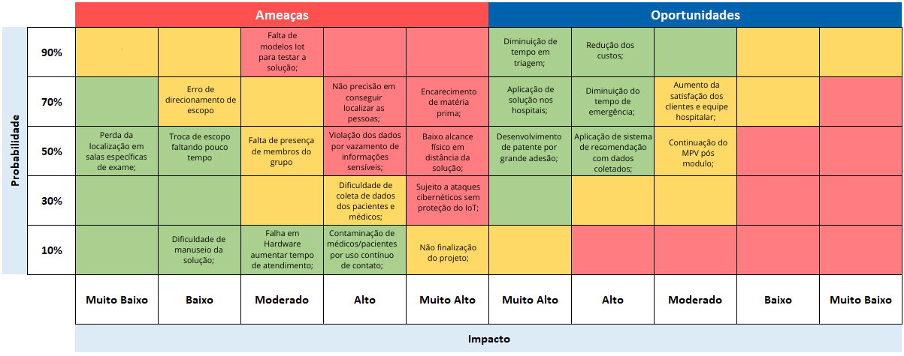
  <p>Fonte: elaboração própria</p>
</div>

&emsp;&emsp;Analisando então a imagem de forma mais clara, abaixo a seguir é possível verificar a transcrição dos riscos existentes e a partir deles, é elaborada objetivamente a possibilidade de planos de ação. Dessa forma, é possível dar evidência ao crucial e preparar o “solo” da empresa para um projeto eficiente e embasado.

&emsp;&emsp;**Ameaças potenciais:**
- Não finalização do projeto (Probabilidade:10% X Impacto: Muito Alto);
- Contaminação de médicos/pacientes por uso contínuo de contato(Probabilidade:10% X Impacto:Alto) ;
- Dificuldade de coleta de dados dos pacientes e médicos (Probabilidade: 30% X Impacto: Alto);
- Não precisão em conseguir localizar as pessoas (Probabilidade:70 % X Impacto:);
- Falta de modelos Iot para testar a solução (Probabilidade: 90% X Impacto: Moderado);
- Dificuldade de manuseio da solução (Probabilidade: 10% X Impacto: Baixo);
- Perda da localização em salas específicas de exame (Probabilidade: 50% X Impacto:Muito Baixo);
- Troca de escopo faltando pouco tempo (Probabilidade: 50% X Impacto: Baixo)
- Falta de presença de membros do grupo (Probabilidade: 50% X Impacto: Moderado)
- Violação dos dados por vazamento de informações sensíveis (Probabilidade: 50% X Impacto: Alto);

&emsp;&emsp;**Ameaças reais:**
- Baixo alcance físico em distância da solução (Probabilidade: 50% X Impacto: Muito alto);
- Contaminação de médicos/pacientes por uso contínuo de contato (Probabilidade: 10% X Impacto: Alto);
- Sujeito a ataques cibernéticos sem proteção do IoT (Probabilidade: 30% X Impacto:Muito Alto);
- Falha em Hardware aumentar tempo de atendimento (Probabilidade: 10% X Impacto:Moderado);
- Encarecimento de matéria prima (Probabilidade: 70% X Impacto: Muito Alto);

&emsp;&emsp;**Oportunidades potenciais:**
- Desenvolvimento de patente por grande adesão (Probabilidade: 50% X Impacto: Muito Alto);
- Aplicação de sistema de recomendação com dados coletados (Probabilidade: 50% X Impacto: Alto);
- Aumento da satisfação dos clientes e equipe hospitalar (Probabilidade: 70% X Impacto: Moderado); 

&emsp;&emsp;**Oportunidades reais:**
- Aplicação de solução nos hospitais (Probabilidade: 70% X Impacto: Muito Alto); 
- Continuação do MPV pós modulo (Probabilidade: 50% X Impacto: Moderado); 
- Diminuição de tempo em triagem (Probabilidade: 90% X Impacto: Muito Alto); 
- Diminuição do tempo de emergência (Probabilidade: 70% X Impacto: Alto); 
- Redução dos custos (Probabilidade: 90% X Impacto: Alto);

&emsp;&emsp;Por fim, tendo a visão panorâmica sobre os riscos que são ameaças e oportunidades, existe a estruturação do Plano de ação em resposta para todos os riscos.Veja-os a seguir:


**Plano de Ameaças Potenciais:**


- **Não finalização do projeto:** Aplicar um cronograma realista e detalhado, com entregas claras, e monitorar o progresso regularmente com o uso de metodologias ágeis como Scrum, Kanban e técnicas como Lean Inception. Alocar recursos suficientes e contingências para possíveis imprevistos. Comunicar-se com os stakeholders e obter feedbacks constantes.


- **Contaminação de médicos/pacientes por uso contínuo de contato:** Seguir protocolo de higienização e esterilização. Usar materiais de fácil higienização na produção e encapsulamento do protótipo


- **Dificuldade de coleta de dados dos pacientes e médicos:** Estabelecer uma metodologia de coleta de dados que seja ética, segura e eficiente. Obter consentimento informado dos participantes e garantir a confidencialidade dos dados com LGPD. Utilizar ferramentas tecnológicas que facilitem a captura, armazenamento e análise dos dados.


- **Não precisão em conseguir localizar as pessoas:** Testar e validar a precisão do sistema de localização antes de implementá-lo. Verificar se há interferências ou obstáculos que possam afetar o sinal. Calibrar o sistema periodicamente e corrigir eventuais falhas.


- **Falta de modelos IoT para testar a solução:** Verificar possibilidade de expansão de orçamento para compra de mais materiais que possibilitem uma amostra maior de equipamentos. Realizar testes pilotos e simulações para avaliar o desempenho dos modelos.


- **Dificuldade de manuseio da solução:** Desenvolver uma proposta amigável e intuitiva para os usuários. Oferecer guia e materiais de apoio para os médicos e pacientes que utilizarão a solução. Além disso, obter feedbacks e sugestões de melhoria.


- **Perda da localização em salas específicas de exame:** Identificar as causas da perda de sinal e buscar soluções alternativas. Pesquisar soluções como instalar repetidores ou antenas para ampliar a cobertura. Orientar os usuários sobre como proceder em caso de perda de localização.
- **Troca de escopo faltando pouco tempo:** Planejar requisitos básicos e essenciais que independem dos requisitos funcionais, garantindo qualidade e flexibilidade para possíveis mudanças.


- **Violação dos dados por vazamento de informações sensíveis:** Reforçar as medidas de segurança da informação. Monitorar constantemente as atividades e acessos aos dados. Reportar e investigar qualquer suspeita ou incidente de vazamento.


**Plano de Ameaças Reais:**


- **Baixo alcance físico em distância da solução:** Dimensionar adequadamente o alcance da solução de acordo com as necessidades do projeto. Utilizar equipamentos e tecnologias que permitam uma maior distância sem perda de qualidade. Verificar se há barreiras físicas ou ambientais que possam reduzir o alcance.


- **Contaminação de médicos/pacientes por uso contínuo de contato:** Adotar medidas de higiene e desinfecção dos equipamentos e dispositivos utilizados na solução. Fornecer equipamentos de proteção individual (EPI) para os profissionais de saúde. Orientar os pacientes sobre como evitar a contaminação por contato.


- **Sujeito a ataques cibernéticos sem proteção do IoT:** Implementar um sistema de proteção do IoT que inclua firewall, antivírus, VPN e atualizações constantes, se possível. Realizar testes de vulnerabilidade e auditorias periódicas. Treinar os usuários sobre como prevenir e detectar ataques cibernéticos.


- **Falha em Hardware aumentar tempo de atendimento:** Realizar manutenções preventivas e corretivas nos equipamentos e dispositivos utilizados na solução. Ter um estoque reserva ou um plano de contingência em caso de falha ou quebra. Registrar e analisar as causas das falhas e buscar soluções definitivas.


- **Encarecimento de matéria prima:** Fazer uma pesquisa de mercado e buscar fornecedores alternativos que ofereçam preços mais competitivos. Renegociar os contratos e condições de pagamento com os fornecedores atuais. Buscar formas de reduzir o consumo ou substituir a matéria-prima por outras mais baratas, quando possível.


**Plano de Oportunidades Potenciais:**


- **Desenvolvimento de patente por grande adesão:** Pesquisar e verificar se a solução é inovadora e original, e se atende aos requisitos legais para obter uma patente. Contratar um especialista em propriedade intelectual para auxiliar no processo de registro da patente. Divulgar e promover a solução no mercado e na mídia.


- **Aplicação de sistema de recomendação com dados coletados:** Desenvolver um algoritmo de recomendação que utilize os dados coletados dos pacientes e médicos para oferecer soluções personalizadas e otimizadas. Testar e validar o sistema de recomendação com um grupo de usuários. Avaliar os resultados e o impacto do sistema na qualidade do atendimento.


- **Aumento da satisfação dos clientes e equipe hospitalar:** Realizar pesquisas de satisfação com os clientes e a equipe hospitalar que utilizam a solução. Identificar os pontos fortes e fracos da solução, bem como as expectativas e necessidades dos usuários. Com os feedbacks, implementar melhorias contínuas na solução, baseadas nos feedbacks recebidos.


**Plano de Oportunidades Reais:**


- **Aplicação de solução nos hospitais:** Buscar parcerias com hospitais que tenham interesse em utilizar a solução. Apresentar os benefícios e vantagens da solução, bem como os requisitos técnicos e operacionais para sua implantação. Fornecer suporte e assistência aos hospitais parceiros.


- **Continuação do MPV pós modulo:** Avaliar o desempenho e os resultados do MPV durante o módulo. Identificar as lições aprendidas e as oportunidades de melhoria. Elaborar um plano de continuidade do MPV, definindo objetivos, metas, indicadores, recursos e cronograma.


- **Diminuição de tempo em triagem:** Medir o tempo médio de triagem dos pacientes e registrar as melhorias obtidas. Gerar relatório comprovando as melhorias observadas.


- **Diminuição do tempo de emergência:** Medir o tempo médio de atendimento dos pacientes na emergência e registrar as reduções de tempo obtidas.Gerar relatório comprovando as melhorias observadas.


- **Redução dos custos:** Medição dos custos pré e pós implementação, a fim de medir com precisão a redução obtida.


&emsp;&emsp;É importante destacar que a matriz de risco é iterativa, o que significa que constantemente ela está sendo alterada, já que riscos deixam de existir por medidas resolutivas tomadas para resolvê-los. Concluindo, com a matriz de risco e as medidas do plano de ação, é possível estruturar uma solução mais segura possível para um modelo de IoT eficiente.

### 3.1.6. Política de Privacidade de acordo com a LGPD

&emsp;&emsp;A Lei Geral de Proteção de Dados⁸ (LGPD) define os direitos do titular dos dados com relação a eles. É regulamentada pela Autoridade Nacional de Proteção de Dados (ANPD) e visa assegurar o uso adequado das informações coletadas. A LGPD abrange a política da privacidade, que é específico sobre como os dados são coletados e usados.(ALBERTACCI, 2021). As informações necessárias para fornecer o serviço dependem do produto ou serviço e é baseado em um contrato,quando exigido por lei, mediante consentimento do cliente.

#### 3.1.6.1 Informações gerais sobre a organização

&emsp;&emsp;Como parceiro de projeto, a Política de Privacidade do Hospital Sírio-Libanês (HSL)⁹ já existente é uma declaração que descreve os tipos de informações coletadas, como elas são usadas, compartilhadas e protegidas. Ao utilizar o website do HSL, o usuário concorda com as práticas descritas na política. E por a solução do projeto Jinwar ser uma extensão dessa organização, está LGPD se baseia nesta organização.

#### 3.1.6.2 Informações sobre o tratamento de dados

&emsp;&emsp;O Hospital Sírio-Libanês (HSL) assegura que o tratamento de dados pessoais é conduzido em estrita conformidade com as leis de proteção de dados aplicáveis, com ênfase na Lei Geral de Proteção de Dados Pessoais (LGPD). O tratamento de dados no HSL engloba a coleta de informações pessoais fornecidas ativamente pelos usuários, como nome completo, e-mail e número de telefone, baseado no consentimento explícito dos mesmos. Além disso, o HSL utiliza medidas técnicas e organizacionais para garantir a segurança dos dados, incluindo proteção contra acesso não autorizado, uso indevido e violações de dados. Embora o HSL se comprometa a manter a privacidade dos usuários, a natureza da internet implica que a segurança total não pode ser garantida, mas o HSL está preparado para agir prontamente em casos de incidentes de segurança.

&emsp;&emsp;Assim sendo o tratamento de dados, o HSL visa oferecer uma experiência respeitosa para os usuários, garantindo que suas informações sejam tratadas com cuidado e em estrita conformidade com as regulamentações de proteção de dados. O consentimento do usuário é fundamental para o tratamento de dados, e o HSL está comprometido em manter a transparência e a segurança em todas as etapas do processo.

#### 3.1.6.3 Quais são os dados coletados

&emsp;&emsp;Segundo a política de proteção de dados da Alma Sírio-Libanês para projeto Jinwar, os seguintes dados são coletados:
Dados pessoais: nome completo, e-mail, número de telefone/celular.
Dados de uso: características do dispositivo de acesso, do navegador, IP (com data e hora), origem do IP, informações sobre cliques, páginas acessadas, as páginas seguintes acessadas após a saída das páginas, ou qualquer termo de procura digitado nos sites ou em referência a estes, dentre outros.

#### 3.1.6.4 Onde os dados são coletados

&emsp;&emsp;Os dados são coletados por meio de cookies, pixeltags, beacons e local shared objects. Essas tecnologias aprimoram a experiência de navegação, adaptando o site às preferências do usuário. Você pode desativar a coleta automática de informações ajustando as configurações do navegador de internet, mas alguns recursos do site podem não funcionar corretamente sem esses dados.

#### 3.1.6.5 Para quais finalidades os dados serão utilizadas

&emsp;&emsp;O Hospital Sírio-Libanês(HSL) utiliza informações e dados pessoais para personalizar o site de acordo com as preferências do usuário e para uso em material institucional, newsletters, convites para palestras e eventos, mediante consentimento do usuário.

#### 3.1.6.6 Onde os dados ficam armazenados

&emsp;&emsp;O Hospital Sírio-Libanês (HSL) adota medidas rigorosas para garantir a segurança dos dados coletados. Os dados são armazenados em um ambiente operacional altamente seguro, com acesso restrito e sem disponibilidade pública. Além disso, o HSL faz uso de tecnologias e infraestrutura de armazenamento de dados em nuvem para a gestão e proteção dessas informações.

#### 3.1.6.7 Qual o período de armazenamento dos dados (retenção)

&emsp;&emsp;O HSL manterá os dados pessoais pelo tempo necessário para cumprir as finalidades para as quais foram coletados, incluindo obrigações legais, contratuais, de prestação de contas ou requisições de autoridades competentes. Quando os dados não forem mais necessários ou relevantes, ou se houver obrigações legais de retenção, eles serão excluídos.

#### 3.1.6.8 Uso de cookies e/ou tecnologias semelhantes

Os cookies são pequenos arquivos de texto que contêm informações como o nome do site que os originou, sua duração e um valor associado. Neste contexto, é importante compreender como o uso de cookies se encaixa nas diretrizes de privacidade e proteção dos dados pessoais dos usuários, por isso, veja a seguir os cookies necessários, funcionais e para marketing, sendo eles acompanhados de descrição e explicitação de quais são utilizados.

- Cookies Necessários: ajudam a entender como os visitantes interagem com as páginas, fornecendo informações sobre as áreas visitadas, o tempo de visita ao site e quaisquer problemas encontrados, como mensagens de erro;

- Espécies: \_ga, \_gid, \_BEAMER_BOOSTED_ANNOUNCEMENT_DATE, \_BEAMER_DATE, \_BEAMER_FIRST_VISIT, \_BEAMER_LAST_POST_SHOWN, \_BEAMER_LAST_UPDATE, \_BEAMER_USER_ID;

- Cookies Funcionais: permitem que as Páginas se lembrem de suas escolhas, para proporcionar uma experiência mais personalizada. Também, possibilitam que os Usuários assistam a vídeos e utilizem ferramentas sociais, campos para comentários, fóruns, entre outros;

- Espécies: \_hjIncludedInPageviewSample, \_hjSessionRejected, \_hjTLDTest, \_hjid, acceptAsPrivacyPolicies;

- Cookies de Marketing: são utilizados para fornecer mais conteúdo relevante e do interesse dos Usuários. Podem ser utilizados para apresentar publicidade mais direcionada ou limitar o número que esta é veiculada nas Páginas. Ainda, esses cookies podem ser utilizados para indicar às Páginas, os sites que o Usuário visitou e o Sírio-Libanês pode compartilhar estas informações com terceiros;

- Espécies: AID, ANID, CONSENT, NID, **Secure-3PAPISID, **Secure-3PSID, DSID, IDE, RUL, 1P_JAR.

#### 3.1.6.9 Com quem esses dados são compartilhados (parceiros, fornecedores, subcontratados)

&emsp;&emsp;Os dados coletados e processados serão compartilhados com a equipe do Alma Sírio-Libanês e com a equipe assistencial do local (usuários finais). Ademais, as informações coletadas podem ser compartilhadas com:
i) Empresas parceiras, quando necessário para a prestação adequada de serviços.
ii) Para proteger os interesses do HSL em conflitos.
iii) Em conformidade com decisões judiciais ou solicitações de autoridades competentes.
Além disso, suas informações podem ser compartilhadas com parceiros específicos contratados, como provedores de infraestrutura tecnológica e serviços de armazenamento em nuvem. Atualmente, compartilha-se dados com os seguintes parceiros:

- Google (Google Analytics e Firebase) - Para obter informações estatísticas sobre o uso dos nossos websites.
- Tasy - Para a gestão de dados de saúde.
- Healthshare - Para armazenamento e gestão de dados e consentimento.
- Carestream - Para armazenamento de exames de imagem e laudos.
- Laboratórios Fleury - Para armazenamento de exames de imagem e laudos.

#### 3.1.6.10 Informações sobre medidas de segurança adotadas pela empresa

&emsp;&emsp; O HSL implementa medidas técnicas e organizacionais para proteger informações e dados pessoais. As informações são armazenadas em um ambiente seguro, inacessível ao público.

#### 3.1.6.11 Orientações sobre como a empresa/organização atende aos direitos dos usuários

&emsp;&emsp; A empresa atende aos direitos dos usuários ao cumprir a regulamentação a respeito de proteção de dados pessoais, por meio das seguintes ações:

1. A confirmação da existência de tratamento;
2. O acesso aos dados;
3. A correção de dados incompletos, inexatos ou desatualizados;
4. A anonimização, bloqueio ou eliminação de dados desnecessários, excessivos ou tratados em desconformidade;
5. A portabilidade de seus dados a outro fornecedor de serviço ou produto, mediante requisição expressa pelo Usuário;
6. A eliminação dos dados tratados com consentimento do Usuário;
7. A obtenção de informações sobre as entidades públicas ou privadas com as quais o HSL compartilhou seus dados;
8. A informação sobre a possibilidade de não fornecer o seu consentimento, bem como de ser informado sobre as consequências, em caso de negativa;
9. A revogação do consentimento.

#### 3.1.6.12 Informações sobre como o titular de dados pode solicitar e exercer os seus direitos

&emsp;&emsp;O titular dos dados pode exercer seus direitos e solicitar seus dados ao agente de tratamento por meio do e-mail dpo.hsl@lbca.com.br, do telefone e do endereço físico em São Paulo.

#### 3.1.6.13 Informações de contato do Data Protection Officer (DPO) ou encarregado de proteção de dados da organização

Agente de tratamento<br>
Hospital Sírio-Libanês - Sociedade Beneficente de Senhoras Hospital Sírio Libanês<br>
CNPJ 61.590.410/0001-24<br>
Rua Adma Jafet, 91, Bela Vista, São Paulo/SP<br>
+55 (11) 3394-0200

### 3.1.7. Bill of Material (BOM)

Antes da montagem e configuração do projeto IoT, é fundamental garantir que todos os componentes necessários estejam disponíveis. A seguir, uma lista detalhada dos materiais que serão usados, a chamada \*Bill od Material(BOM). Esta lista foi cuidadosamente elaborada para garantir que todas as especificidades do projeto sejam atendidas:

<div align="center">
  <p><b>Tabela 01 </b> - Bill of Material</p>
  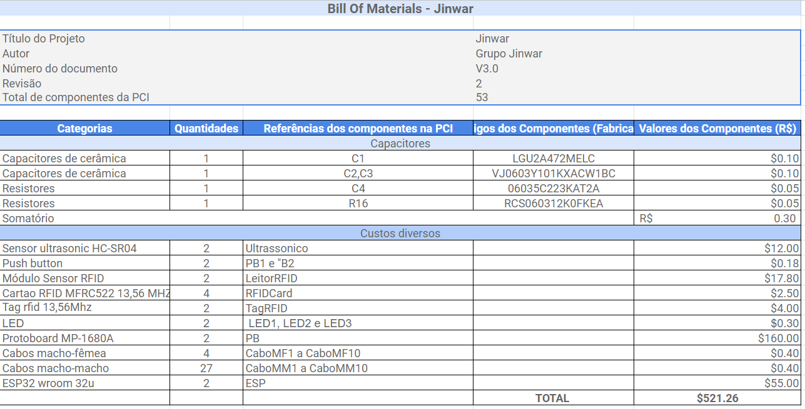
  <p><b>Fonte:</b> elaboração por Jinwar.</p>
</div>

&emsp;&emsp; A partir do BOM, é possível perceber que as peças de maior valor são a Protoboard MP-1680A, essencial para o planejamento e fácil remontagem do protótipo e a placa ESP32 Wroom 32u, peça central que conecta todas as demais peças e carrega o código, de fato, o código.

## 3.2. Domínio de Fundamentos de Experiência de Usuário

&emsp;&emsp;Nesta seção, busca-se entender quais são as personas do projeto a ser desenvolvido, a jornada de usuário, visualizar storyboards, user stories e desenhos esquemáticos da solução IoT. Dessa maneira, a solução Jinwar poderá ser mais personalizada para os pacientes e colaboradores do Hospital Sírio-Libanês e consequentemente a chance de os usuários adotarem a solução pode ser maior.

### 3.2.1. Personas

&emsp;&emsp;No desenvolvimento de sistemas e soluções, é fundamental entender para qual público se está desenvolvendo. Neste sentido, as personas representam uma ferramenta poderosa para o design centrado no usuário, possibilitando uma visão mais humanizada e próxima da realidade dos futuros usuários. No sprint 1, foram definidas três personas¹¹ principais que irão interagir com o sistema ou produto que será desenvolvido: a paciente, profissional da saúde e o Gestor de Relacionamento Médico-Paciente.

&emsp;&emsp;Conforme destacado no artigo intitulado "Persona Preparedness: A Survey Instrument for Measuring Organizational Readiness for Persona Deployment"¹⁰, as personas desempenham um papel fundamental na promoção da coesão e da clareza de comunicação em equipes de design. Além disso, elas contribuem para elevar o nível de empatia em relação aos usuários, bem como para evitar o viés centrado no desenvolvimento e design de produtos. Devido a esses inúmeros benefícios, a criação de personas se torna uma ferramenta essencial para obter uma compreensão holística do projeto Iot. Veja a seguir a construção das persona da equipe Jinwar.

&emsp;&emsp;A paciente, Maria dos Santos, é uma mulher de meia-idade que busca uma experiência hospitalar humanizada, eficiente e que respeite suas necessidades enquanto indivíduo. Sua vida agitada em São Paulo e sua família são centrais em suas decisões, e sua interação com a saúde digital revela um perfil intermediário no que tange ao letramento digital.

&emsp;&emsp;Por outro lado, temos o profissional da saúde, Dr. Roberto Oliveira, um cardiologista experiente que valoriza a otimização do tempo, a formação contínua e as tecnologias de ponta para proporcionar o melhor atendimento possível aos seus pacientes. Seu letramento digital é avançado, demonstrando a necessidade de um sistema que atenda suas demandas de maneira eficiente.

&emsp;&emsp;Adicionalmente, introduzimos uma terceira figura chave no cenário de interações do nosso sistema: Rafael Souza, ocupando o essencial papel de Gestor de Relacionamento Médico-Paciente. Sua inclusão na lista de personas é estratégica e visa aprimorar a compreensão das dinâmicas internas e externas do ambiente hospitalar, garantindo assim a conexão entre o paciente e o profissional da saúde.

&emsp;&emsp;Ao detalharmos estas personas, é possível entender melhor suas dores, desejos e necessidades, permitindo o desenvolvimento de soluções mais alinhadas com suas expectativas e realidades. A seguir, um aprofundamento em cada uma dessas personas para compreender mais sobre seus backgrounds e como elas interagem com o produto.

#### **Persona: Paciente**

<div align="center">
  <p><b>Figura 05 </b> - Persona 1 </p>
  
  <p><b>Fonte:</b> elaboração por Jinwar com uso de IA this-person-does-not-exist.</p>
</div>

**Nome:** Maria dos Santos

**Informações demográficas:**

- **Idade:** 45 anos
- **Estado Civil:** Casada
- **Filhos:** Dois adolescentes
- **Profissão:** Professora em uma escola local
- **Localização geográfica:** São Paulo, SP
- **Perfil socioeconômico:** Classe média
- **Formação acadêmica:** Graduação em Pedagogia

&emsp;&emsp; **Background:** Maria é uma dedicada professora que equilibra sua carreira com o cuidado de seus dois filhos adolescentes. Moradora da cidade de São Paulo, ela vive um cotidiano agitado entre trabalho, casa e compromissos pessoais. Tem uma vida ativa e valoriza muito a saúde, tanto a sua quanto a de sua família.

**Dores, necessidades e desejos:**

1. Desejo de ser atendida rapidamente.
2. Precisa de uma experiência de atendimento eficiente, evitando esperas prolongadas entre procedimentos.
3. Valoriza a humanização no atendimento, sentindo-se mais tranquila quando os profissionais têm conhecimento sobre sua saúde e histórico.
4. Acredita na importância do envolvimento do paciente e da família no processo de cuidado.
5. Espera que o hospital tenha coordenação no cuidado para evitar uso desnecessário de recursos.

&emsp;&emsp; **Cenários de interação:** Maria costuma ir ao hospital para exames de rotina e consultas médicas. Ela interage com o sistema e produtos tanto na sala de espera quanto durante seus procedimentos médicos.

**Interesses e hábitos relacionados ao sistema ou produto:**

- Frequentemente lê sobre saúde e bem-estar para se manter informada.
- Usa aplicativos de saúde no celular para monitorar sua diabetes.
- Pesquisa sobre inovações na área de saúde, como a computação ubíqua, para entender como podem auxiliá-la em seu tratamento.

**Nível de letramento digital:**

&emsp;&emsp;Intermediário. Maria utiliza tecnologias diariamente, tanto para o trabalho quanto para assuntos pessoais. No entanto, pode ter dificuldades com tecnologias muito avançadas ou interfaces complicadas.

**Citações diretas:**

- "Eu preciso saber que estão cuidando de mim e que conhecem meu histórico."
- "A saúde não é só física, é preciso humanizar o atendimento."
- "Meus filhos e eu somos uma equipe. Todos nós temos um papel no cuidado da minha saúde."

---

#### **Persona: Profissional da saúde¹²**

<div align="center">
  <p><b>Figura 06 </b> - Persona 2 </p>
  
  <p><b>Fonte:</b> elaboração por Jinwar com uso de IA this-person-does-not-exist.</p>
</div>

**Nome:** Dr. Roberto Oliveira

**Informações demográficas:**

- **Idade:** 38 anos
- **Especialidade:** Cardiologia
- **Estado Civil:** Solteiro
- **Hobbies:** Correr em parques
- **Localização no hospital:** Consultório
- **Anos de experiência:** 10 anos

&emsp;&emsp; **Background:** Dr. Roberto Oliveira é um cardiologista com 10 anos de experiência e atualmente trabalha no Hospital Sírio-Libanês. Em seu tempo livre, gosta de correr em parques.

**Dores, necessidades e desejos:**

1. Otimização de tempo entre os pacientes, garantindo cuidado adequado.
2. Acesso rápido a informações sobre o local de seus pacientes e outros membros da equipe.
3. Valorização da formação contínua e oportunidade de compartilhar conhecimentos com profissionais renomados da saúde.
4. Apreciação pela tecnologia de ponta do hospital, visando a melhoria na eficiência e precisão na entrada de dados.

**Cenários de interação:¹³** Dr. Roberto passa grande parte de seu tempo no consultório, mas frequentemente visita a UTI Cardiológica e a Sala de Exames.

**Interesses e hábitos relacionados ao sistema ou produto¹⁴:**

- Está sempre em busca de formação contínua e atualizações na área de cardiologia.
- Usa sistemas digitais de saúde para gerenciar prontuários e agendar consultas.
- Valoriza a troca de conhecimento com colegas da área e participa ativamente de conferências e seminários.

**Nível de letramento digital:**

&emsp;&emsp; Avançado. Dr. Roberto é fluente em várias tecnologias e sistemas de saúde, e sente-se confortável em adaptar-se a novas plataformas conforme necessário.

**Citações diretas:¹⁵**

- "Preciso otimizar meu tempo entre pacientes para garantir um atendimento de qualidade."
- "A formação contínua e a troca de conhecimento são fundamentais na medicina."
- "A tecnologia de ponta do hospital é essencial para minha prática médica diária."

---

#### **Persona: Gestor de Relacionamento Médico-Paciente**

<div align="center">
  <p><b>Figura 07 </b> - Persona 3 </b></p>
  
  <p><b>Fonte:</b> elaboração por Jinwar com uso de IA this-person-does-not-exist.</p>
</div>

**Nome:** Rafael Souza

**Informações demográficas:**

- **Idade:** 35 anos
- **Especialidade:** Gestão em Saúde
- **Estado Civil:** Casado
- **Filhos:** 1 filho de 6 anos
- **Profissão:** Gestor de Relacionamento Médico-Paciente
- **Localização geográfica:** São Paulo, SP
- **Perfil socioeconômico:** Classe média-alta
- **Formação acadêmica:** MBA em Gestão Hospitalar

&emsp;&emsp; **Background:¹⁶** Rafael trabalha há 8 anos no Hospital Sírio-Libanês, coordenando a ligação entre médicos de alto padrão, como Dr. Roberto Oliveira, e pacientes afluentes que frequentam o hospital em busca do melhor cuidado médico. Ele entende as demandas e particularidades desse público, garantindo que a comunicação entre o médico e o paciente ocorra de forma eficaz e personalizada.

**Dores, necessidades e desejos:**

1. Assegurar que as necessidades específicas dos pacientes sejam atendidas com excelência.
2. Facilitar a comunicação entre médicos e pacientes, otimizando o tempo de ambos.
3. Mantém um alto padrão de atendimento, refletindo a reputação de elite do hospital.
4. Busca continuamente feedbacks para melhorar a experiência do paciente.
5. Precisa lidar com as expectativas elevadas de pacientes que buscam um serviço diferenciado.

**Cenários de interação:¹⁷** Rafael divide seu tempo entre o escritório, salas de reunião, e acompanhamento da interação entre médicos e pacientes em áreas como a UTI Cardiológica, Sala de Exames, consultórios e Pronto Atendimento.

**Interesses e hábitos relacionados ao sistema ou produto:**

- Em constante contato com novas tecnologias que podem melhorar o relacionamento médico-paciente.
- Participa de treinamentos e workshops para aprimorar suas habilidades em gestão de relacionamento.
- Focado em criar um ambiente harmonioso e eficaz para médicos e pacientes.

**Nível de letramento digital:**

&emsp;&emsp;Avançado. Rafael está acostumado a trabalhar com sistemas digitais de saúde e plataformas de CRM (Customer Relationship Management).

**Citações diretas:**

- "A comunicação eficaz entre médico e paciente é crucial para manter o padrão Sírio-Libanês."
- "Entender as nuances e expectativas de nossos pacientes é fundamental, não importa se ele(a) seja influente ou não."
- "Precisamos estar sempre um passo à frente, oferecendo soluções inovadoras para aprimorar a experiência do paciente."

---

&emsp;&emsp;Conclui-se que a elaboração de personas, como Maria dos Santos, Dr. Roberto Oliveira e Rafael Souza oferecem perspectivas sobre a realidade diversa e multifacetada dos potenciais usuários de um sistema ou produto. Estas personas emergem como ferramentas inestimáveis que orientam equipes de design e desenvolvimento, permitindo-lhes abordar com maior precisão as necessidades autênticas dos usuários.

&emsp;&emsp;Ao aprofundar na compreensão destas personas e ao integrar os insights do design centrado no usuário, é possível assegurar que as soluções criadas sejam não apenas avançadas do ponto de vista tecnológico, mas também profundamente relevantes em termos humanos. No entrelaço entre tecnologia e humanidade, há o genuíno potencial para transformação e inovação no campo da saúde.

### 3.2.2. Jornadas do Usuário e Storyboard

&emsp;&emsp;Um Canvas de **Jornada do Usuário**¹⁸ é uma ferramenta visual que permite mapear de forma concisa a experiência do usuário ao interagir com um produto, neste caso, a solução Jinwar. Além disso, pode-se encontrar os passos das personas relacionados à solução em questão, destacando suas ações, sentimentos, pensamentos e planejamentos ao longo de sua jornada. Essa ferramenta desempenha um papel crucial no design centrado no usuário, pois fornece uma representação abrangente das interações do usuário com o produto, permitindo às equipes identificar pontos de dor, oportunidades de melhoria e criar soluções mais alinhadas às necessidades e expectativas dos usuários, como por exemplo, para um paciente, ser atendido rápido; e para um médico, identificar rapidamente para onde deve ir . Ademais, o Canvas de Jornada do Usuário promove uma compreensão compartilhada do cliente em toda a equipe, facilitando uma abordagem mais eficaz no desenvolvimento, resultando em experiências mais satisfatórias. Veja a seguir as jornadas de usuário das personas Maria dos Santos e Dr. Roberto Oliveira.

<div align="center">
  <p><b>Figura 08</b> - Jornada do Usuário 1</p>
  
  <p><b>Fonte:</b> elaboração por Jinwar.</p>
</div>

<div align="center">
  <p><b>Figura 09</b> - Jornada do Usuário 2</p>
  
  <p><b>Fonte:</b> elaboração por Jinwar.</p>
</div>

&emsp;&emsp;Dessa forma, a jornada do usuário proporciona uma visão detalhada das etapas cruciais para as personas, como a urgência do tratamento do paciente no contexto hospitalar, minimizando a perda de tempo na triagem para garantir sua saúde e bem-estar. Além disso, ela delineia a importância da coleta de feedback para aprimorar a solução. No que tange ao médico, a jornada descreve a entrada e saída no sistema, potencialmente simplificada por meio de um check-out automático, além de considerar a criação de um painel de orientação para o médico. Essa abordagem também abre portas para a expansão do escopo, incluindo o desenvolvimento de uma interface que permita uma rápida visualização dos dados do paciente já cadastrado, beneficiando o atendimento do sistema no caso da continuação do MVP( Produto Mínimo Viável).

&emsp;&emsp;Um **storyboard**¹⁹ é uma ferramenta visual que descreve uma narrativa de eventos por meio de uma série de ilustrações organizadas em um painel ou quadro. No contexto da solução IoT, o storyboard é uma representação gráfica que detalha a interação entre dispositivos, sistemas e usuários, demonstrando como a tecnologia IoT é usada para resolver um problema ou atender a uma necessidade específica.

&emsp;&emsp;Ele desempenha um papel crucial, pois permite que os designers, engenheiros e stakeholders visualizem a implementação da tecnologia em ação. Além disso, um storyboard pode destacar os pontos de dor ou oportunidades de melhoria no processo, facilitando a identificação de aprimoramentos antes da implementação real da solução IoT. Veja a seguir o Storyboard do projeto:

<div align="center">
  <p><b>Figura 10</b>- Storyboard </b></p>
  
  <p>Fonte: elaboração por Jinwar e uso da plataforma DALL·E 2 para geração das imagens.</p>
</div>

&emsp;&emsp;Como demonstrado no storyboard, o objetivo da solução IoT é minimizar as dificuldades enfrentadas tanto pelos pacientes na espera quanto pelos funcionários do hospital no fluxo de trabalho. Isso se torna possível através da otimização do trânsito e atendimento no hospital, por meio da identificação da localização de pacientes e médicos, e, posteriormente, pela realocação eficaz de recursos, de acordo com a disponibilidade de equipes de atendimento em tempo real.

### 3.2.3. User Stories

&emsp;&emsp;No desenvolvimento de projetos, compreender as necessidades de todos os envolvidos é de suma importância. As User Stories são instrumentos valiosos neste contexto, pois permitem capturar requisitos sob a ótica do usuário final de maneira clara e direta.

&emsp;&emsp;De acordo com Ricardo Arruda no artigo “o que são User Stories(Estórias de Usuário)”²⁰, uma **User Story** é a representação clara e informal que expressa a necessidade e/ou requisito de um potencial usuário. Também pode ser considerada uma parte de um objetivo final. A User Story é a menor unidade de trabalho com base na “necessidade do cliente final que vai utilizar e/ou interagir com o Produto.”

&emsp;&emsp;Uma User Story é uma breve descrição de uma necessidade ou desejo do usuário, redigida a partir de sua perspectiva. Elas não apenas destacam funcionalidades baseadas nas demandas reais dos stakeholders, mas também direcionam o desenvolvimento para o que é verdadeiramente crucial: entregar valor ao usuário.

&emsp;&emsp;Por meio das User Stories, conseguimos identificar e priorizar funcionalidades, estabelecer critérios de aceitação e assegurar que o sistema desenvolvido esteja em sintonia com as necessidades autênticas dos usuários. Além disso, essas histórias conferem uma visão mais clara sobre o MVP (Produto Mínimo Viável) que será entregue ao cliente, ajudando a dissipar quaisquer dúvidas sobre os desafios específicos que o projeto visa abordar. Para maximizar sua eficácia, é essencial que todos os stakeholders, como pacientes, equipe médica, gerentes, entre outros, estejam envolvidos no processo de definição e documentação dessas histórias.

&emsp;&emsp;Para exemplificar como as User Stories podem abordar essas necessidades no contexto hospitalar, eis algumas histórias:

- Como paciente do PA, desejo ser rapidamente encaminhado para a triagem logo após minha chegada, para que eu possa ter minha situação prontamente avaliada e, consequentemente, retornar para minha rotina e família o mais breve possível.

- Como paciente em consulta, é de meu interesse ser direcionado de maneira clara e eficiente logo após o término da mesma, para que eu possa, conforme a recomendação médica, seguir para a enfermaria ou sala de emergência sem enfrentar confusões, ou demoras desnecessárias.

- Como médico(a) atuante no PA, é vital para mim contar com um processo de triagem eficiente para que eu otimize meu atendimento, possibilitando que eu me concentre integralmente nas necessidades mais urgentes dos pacientes que buscam auxílio.

- Como atendente da recepção do PA, anseio por uma ferramenta ou método eficaz de gerenciamento de filas, para que eu possa categorizar, organizar e priorizar os pacientes conforme suas necessidades individuais, garantindo, assim, um atendimento ágil e humanizado.

- No contexto de uma emergência, como médico(a), preciso ter acesso a informações claras e atualizadas sobre o status e localização do paciente em crise. A agilidade e precisão dessas informações são vitais para que decisões rápidas sejam tomadas, maximizando as chances de um desfecho positivo.

- Como gerente de operações hospitalares, eu quero relatórios detalhados sobre o tempo que pacientes e equipe gastam em diferentes estágios do fluxo do PA, para que eu possa identificar gargalos e otimizar os processos internos, melhorando a qualidade e eficiência do atendimento.

&emsp;&emsp;Diante disso, a incorporação de User Stories provou ser um método eficaz para capturar e priorizar as necessidades dos usuários finais, alinhando as soluções propostas com as demandas reais dos stakeholders envolvidos no contexto hospitalar. Através de uma comunicação clara e direta, foi possível desenhar funcionalidades que não apenas atendem às expectativas dos usuários, mas também proporcionam uma entrega de valor significativa, visando a otimização de processos e a melhoria contínua na prestação de serviços hospitalares.

&emsp;&emsp;Este processo reforça a importância de uma abordagem centrada no usuário, especialmente em ambientes críticos como o hospitalar, onde a eficácia do atendimento é de suma importância. A metodologia de User Stories, conforme descrito por Ricardo Arruda, serviu como um instrumento valioso para traduzir as necessidades dos usuários em requisitos funcionais, proporcionando uma base sólida para o desenvolvimento de um sistema que busca atender de maneira eficiente às demandas apresentadas neste contexto específico.

### 3.2.4. Protótipo de interface com o usuário

&emsp;&emsp;Os protótipos de desenvolvidos para uma solução IoT voltada para a identificação hospitalar, tem o objetivo é mostrar como a solução proposta pode facilitar o acesso e o gerenciamento das informações dos pacientes, dos profissionais de saúde e dos ambientes do hospital, por meio de tags adesivas que contêm dados relevantes e que podem ser lidas por dispositivos ESP32 com RFID. Para ilustrar a solução, foi desenvolvido Desenhos Esquemáticos e um Wireframe que ajudam a visualizar a solução e objetificar como será feito o desenvolvimento dela. Vejam a descrição delas mais aprofundadas a seguir. Para maior qualidade de interação, **acesse o link do Figma:** [Protótipo de interface](https://www.figma.com/file/muPUUxIcDjIYIxSHhlDXJ9/wireframe_jin?type=design&node-id=54%3A5907&mode=design&t=JKiqkUdx8OsRxJ8f-1) com ambas interfaces e guia de estilos da solução.

#### 3.2.4.1 Desenhos Esquemáticos

&emsp;&emsp;Os desenhos esquemáticos desenvolvidos para uma solução IoT Jin do grupo Jinwar é voltada para a identificação hospitalar. O objetivo é mostrar como a solução proposta pode facilitar o acesso e o gerenciamento das informações dos pacientes, dos profissionais de saúde e dos ambientes do hospital, por meio de tags adesivas que contêm dados relevantes e que podem ser lidas por dispositivos ESP32 com RFID.

&emsp;&emsp;Os desenhos esquemáticos são representações gráficas simplificadas da solução IoT, indicando os sensores, controles e atuadores do dispositivo, bem como as possíveis interações e leituras de estado do sistema. Eles permitem visualizar o funcionamento e a arquitetura da solução, sem entrar em detalhes técnicos ou estéticos.

&emsp;&emsp;A seguir, foi descrito os desenhos esquemáticos desenvolvidos, explicando como as tags adesivas podem ser usadas como wearables pelos médicos, fisioterapeutas e outros, e como elas podem ser coladas nos pacientes e nos equipamentos em caso de necessidade. Cada tag possui um chip RFID que transmite os dados por meio de ondas de rádio. Em cada ambiente do hospital, há um ESP32 com RFID que recebe os dados das tags e os envia para um servidor central. O ESP32 é um microcontrolador que permite a configuração, inserção e adaptação dos dados para os clientes e o corpo médico. Assim, o sistema de IoT proporciona uma maior eficiência, segurança e qualidade no atendimento hospitalar.

<div align="center">
  <p><b>Figura 11</b>- Desenho Esquemático 1 </b></p>
  
  <p><b>Fonte:</b> elaboração por Jinwar com uso da Firefly Vector, IA em versão Beta do  Adobe Illustrator.</p>
</div>
<div align="center">
  <p><b>Figura 12</b>- Desenho Esquemático 2 </b></p>
  
  <p><b>Fonte:</b> elaboração própria com uso da Firefly Vector, IA em versão Beta do  Adobe Illustrator.</p>
</div>
<div align="center">
  <p><b>Figura 13</b>- Desenho Esquemático 3</b></p>
  
  <p><b>Fonte:</b> elaboração por Jinwar com uso da Firefly Vector, IA em versão Beta do  Adobe Illustrator.</p>
</div>
<div align="center">
  <p><b>Figura 14</b>- Desenho Esquemático 4 </b></p>
  
  <p><b>Fonte:</b> elaboração por Jinwar com uso da Firefly Vector, IA em versão Beta do  Adobe Illustrator.</p>
</div>

&emsp;&emsp; Os desenhos esquemáticos apresentados revelam a funcionalidade das tags adesivas no sistema de IoT para identificação hospitalar. O propósito principal é simplificar o acesso e a gestão das informações dos pacientes, profissionais de saúde e ambientes hospitalares. No entanto, os esquemas não apenas facilitam essa função, mas também auxiliam na detecção de possíveis falhas. Cada figura demonstra a operação da solução; especificamente, a Figura 14 destaca a interação entre o médico e o controlador. O controlador, representado pela mulher à esquerda, está direcionado para o painel de controle, enquanto a médica à direita consulta a localização do paciente a ser atendido. A solução proposta por Jinwar consiste em tags utilizáveis como dispositivos vestíveis por médicos, fisioterapeutas e outros profissionais, contendo dados relevantes sobre o ambiente e as pessoas identificadas. Estas tags podem ser aplicadas nos pacientes e equipamentos conforme necessário, permitindo identificar indivíduos, localizações e atividades. Cada tag é equipada com um chip RFID que transmite dados via ondas de rádio. Em cada ambiente hospitalar, um ESP32 com RFID recebe e encaminha os dados das tags para um servidor central. O ESP32, um microcontrolador versátil, possibilita a configuração, inserção e adaptação dos dados para os clientes e equipe médica. Dessa forma, o sistema de IoT eleva a eficiência, segurança e qualidade do atendimento hospitalar.

&emsp;&emsp;Quando observa-se as jornadas do usuário, as personas estabelecidas, como o Dr. Roberto (médico) e Maria (paciente), terão a oportunidade de economizar tempo significativamente. As Figuras 8 e 9, ilustrando as jornadas do usuário, destacam como a solução pode otimizar o tempo deles e identificar oportunidades para economia de tempo em todo o fluxo do pronto atendimento.

#### 3.2.4.2 Wireframe

&emsp;&emsp;Os wireframes são representações gráficas simplificadas da interface da dashboard, que é a plataforma web onde os dados da solução IoT podem ser acessados e visualizados. Eles permitem visualizar a estrutura e o layout da interface, sem entrar em detalhes de cores, fontes ou imagens. Os wireframes desenvolvidos foram baseados nas possibilidades do sistema Ubidots, que é uma plataforma de IoT que oferece recursos para criar dashboards personalizados. Os wireframes mostram como a dashboard pode exibir as informações dos pacientes, dos profissionais de saúde e dos ambientes do hospital, por meio de gráficos, tabelas, mapas e outros elementos visuais. Veja o wireframe a seguir:

<div align="center">
  <p><b>Figura 15</b>- Dashboard</b></p>
  
  <p><b>Fonte:</b> elaboração por Jinwar.</p>
</div>

&emsp;&emsp;Conclui-se, portanto, que os wireframes são ferramentas indispensáveis na criação de dashboards para soluções em Internet das Coisas (IoT), oferecendo uma representação visual simplificada crucial para o planejamento inicial das interfaces de usuário. Especificamente para uma plataforma web direcionada à gestão do relacionamento médico-paciente na área da saúde, os wireframes facilitam a organização e a exibição das informações de pacientes, profissionais de saúde e do ambiente hospitalar. Utilizando o sistema Ubidots, mencionado anteriormente, é possível desenvolver dashboards personalizados e flexíveis, notáveis pela habilidade de combinar diversos tipos de dados em elementos visuais, como gráficos, tabelas e mapas. Esse dashboard foi desenvolvido para o controlador, referenciado na persona 3 (figura 7), pensando em como as informações poderiam ser mais facilmente compreendidas para auxiliar na organização dos médicos até seus pacientes. Essa abordagem não só aprimora a experiência do controlador, mas também a gestão e o monitoramento de dados vitais no contexto hospitalar, contribuindo assim para um funcionamento mais eficiente e uma tomada de decisão informada.

## 3.3. Solução Técnica

&emsp;&emsp; A solução técnica proposta para atender às demandas de um projeto de Internet das Coisas (IoT) é fundamentada em um conjunto de Requisitos Funcionais. Estes requisitos descrevem as funcionalidades e operações cruciais que um sistema IoT deve desempenhar. Inicialmente, é vital que o sistema seja capaz de identificar o portador da _tag_ e atribuir a ele um papel dentro da instituição, como Paciente, Fisioterapia, Enfermagem ou Médico. Esses requisitos funcionais fornecem uma base sólida para o desenvolvimento do projeto, por isso, veja a seguir as demais seções sobre a solução técnica.

### 3.3.1. Requisitos Funcionais

&emsp;&emsp; Os Requisitos Funcionais são as especificações que descrevem as funções, capacidades e operações que um sistema deve desempenhar em um projeto de Internet das Coisas (IoT). Eles são essenciais para garantir que um dispositivo IoT ou sistema atenda às necessidades e expectativas dos usuários.

&emsp;&emsp; **RF1: Identificação do portador da _Tag_**  
Descrição: O sistema deve ser capaz de identificar o portador da _tag_ e atribuir a ele um papel dentro da instituição, como Paciente, Fisioterapia, Enfermagem ou Médico.

&emsp;&emsp; **Regra de Negócio Relacionada:** O sistema deve utilizar informações precisas para garantir a identificação correta do portador da _tag_ e seu papel, evitando confusões no direcionamento do atendimento.

&emsp;&emsp; **RF2: Rastreamento em tempo real**
Descrição: O sistema deve ser capaz de rastrear a localização do portador da _tag_ em tempo real, enquanto ele se move dentro do hospital.

&emsp;&emsp; **Regra de Negócio Relacionada:** O sistema deve garantir um rastreamento preciso e contínuo, minimizando atrasos e erros de localização.

&emsp;&emsp; **RF3: Avaliação de Tempos de Chegada e Saída**  
Descrição: O sistema deve permitir a avaliação dos tempos de chegada e saída do portador da _tag_ em regiões demarcadas dentro do hospital.

&emsp;&emsp; **Regra de Negócio Relacionada:** As demarcações devem ser definidas de forma precisa, ajudando na identificação de áreas críticas do hospital.

&emsp;&emsp; **RF4: Resposta a Códigos de Emergência**  
Descrição: O sistema deve permitir que o portador da _tag_ possa expressar uma ação em resposta a códigos de emergência e receber informações sobre a localização do código e quais equipes estão respondendo a ele.

&emsp;&emsp; **Regra de Negócio Relacionada:** A comunicação de códigos de emergência e as ações subsequentes devem ser eficazes para garantir a segurança dos pacientes.

&emsp;&emsp; **RF5: Avaliação de Tempo de Resposta a Códigos**  
Descrição: O sistema deve permitir a avaliação do tempo de resposta ao código de emergência, o trajeto realizado pela equipe de atendimento e o tempo de chegada até o local do código.

&emsp;&emsp; **Regra de Negócio Relacionada:** Essa avaliação é fundamental para otimizar a resposta a códigos de emergência, garantir a eficiência da equipe e determinar pontos de fluxo lento.

&emsp;&emsp; **RF6: Portabilidade e Resistência do Dispositivo**  
Descrição: O dispositivo de _tag_ deve ser portátil, fácil de manipular e resistente às condições hospitalares.

&emsp;&emsp; **Regra de Negócio Relacionada:** O dispositivo deve ser projetado para suportar o uso constante.

&emsp;&emsp; **RF7: Prevenção de Esquecimento da _Tag_**  
 Descrição: O sistema deve abordar o problema de as pessoas não devolverem a _tag_ ao sair do hospital ou ao entrar em salas de equipamentos sensíveis, como tomógrafos e ressonância magnética.

&emsp;&emsp; **Regra de Negócio Relacionada:** É essencial implementar medidas que incentivem os portadores a devolver as _tags_ após o uso, ou que monitorem seu movimento para evitar perdas ou esquecimentos.

&emsp;&emsp; Esses requisitos funcionais servem como orientação durante o desenvolvimento do projeto, pois diminuem a chance de falhas no sistema e corroboram para que o sistema seja capaz de atender às expectativas estabelecidas.

### 3.3.2. Requisitos Não Funcionais

&emsp;&emsp; Os requisitos não funcionais são os requisitos que definem como um sistema deve se comportar em determinadas situações, independentemente das suas funcionalidades básicas. Eles estabelecem os atributos de qualidade do projeto, tais como desempenho, segurança, usabilidade, escalabilidade e manutenção. Os requisitos não funcionais são essenciais para garantir que o sistema atenda às necessidades e expectativas do cliente, bem como aos padrões de qualidade exigidos. No contexto do projeto IoT, onde se utiliza RFID para localizar, classificar e temporalizar pessoas, os requisitos não funcionais podem envolver aspectos como a precisão da leitura das etiquetas, a confiabilidade da comunicação entre os dispositivos, a proteção dos dados pessoais e a facilidade de integração com outras aplicações.

&emsp;&emsp;Veja a seguir os requisitos não funcionais do projeto JinWar:

<div align="center">
  <p><b>Quadro 2</b>- Requisitos não funcionais</b></p>

| Identificador | Categoria            | Requisito                                                                                                                                                                                         |
| ------------- | -------------------- | ------------------------------------------------------------------------------------------------------------------------------------------------------------------------------------------------- |
| RFN01         | **Performance**      | - O sistema deve possuir baixa latência, com um tempo de resposta máximo de 500 milisegundos.                                                                                                     |
| RFN02         | **Performance**      | - O sistema deve ser capaz de informar a localização com precisão de 6 metros.                                                                                                                    |
| RFN03         | **Escalabilidade**   | - O sistema deve ser economicamente viável para replicação e expansão.                                                                                                                            |
| RFN04         | **Adaptabilidade**   | - O sistema deve funcionar em ambientes com diferentes características, incluindo temperaturas variadas, sinais intermitentes e em diferentes andares, bem como integrar com diferentes sistemas. |
| RFN05         | **Manutenção**       | - O sistema deve registrar todas as atividades relevantes para possibilitar uma manutenção e depuração eficaz, como timestamp de registros de uso.                                                |
| RFN06         | **Operabilidade**    | - O sistema deve incluir ferramentas de monitoramento para acompanhar o desempenho e a disponibilidade do sistema.                                                                                |
| RFN07         | **Segurança**        | - O sistema deve exigir autenticação por senha para acessar e visualizar os dados de fluxo.                                                                                                       |
| RFN08         | **Disponibilidade**  | - A solução IoT deve ser projetada para funcionar 24 horas por dia e 7 dias por semana, exceto nos períodos de manutenção programada.                                                             |
| RFN09         | **Recuperabilidade** | - O sistema deve realizar backups automáticos de dados e configurações, programados para ocorrer diariamente.                                                                                     |
| RFN10         | **Reusabilidade**    | - O sistema deve ser projetado para permitir sua reutilização em diferentes contextos e projetos.                                                                                                 |

  <p><b>Fonte:</b> elaboração por Jinwar.</p>
</div>

&emsp;&emsp; Diante dos requisitos não funcionais elencados, pode-se perceber que os mais críticos para o sucesso do projeto são os relacionados à performance e à disponibilidade do sistema. Esses requisitos exigem que o sistema seja capaz de fornecer uma resposta rápida e precisa aos usuários, bem como operar de forma contínua e ininterrupta. Esses desafios demandam uma solução IoT robusta, eficiente e confiável, que utilize tecnologias adequadas e otimizadas para o contexto do projeto.

### 3.3.4. Arquitetura da Solução

&emsp;&emsp;Com base nos requisitos levantados, a arquitetura da solução para o sistema começou a tomar forma. Em resposta ao RF1- Identificação do portador da Tag, a solução será fundamentada na utilização de sensores RFID, a fim de coletar os dados que permitem identificar os portadores da tag, sendo eles: nome, cargo, sexo, localização e horário da ativação.

&emsp;&emsp;A arquitetura da solução visa melhorar o entendimento do projeto, a partir de uma visão mais técnica sobre os componentes, tecnologias e fluxo de uso de cada parte. Considerando o entendimento de negócio, os requisitos funcionais e os requisitos não funcionais do projeto, foi feita a arquitetura da solução em blocos. Essa representação visual proporciona uma compreensão mais clara das interações entre os elementos, destacando a fluidez do fluxo de dados e as conexões cruciais que sustentam a funcionalidade global do sistema.

&emsp;&emsp;O diagrama de fluxo é uma importante ferramenta de visualização da arquitetura de uma solução computacional. Ele possibilita uma visão mais ampla do comportamento da solução e todas as etapas e tecnologias envolvidas.

&emsp;&emsp;A partir do diagrama de arquitetura a seguir, é possível identificar como o token rfid, o sensor, o microcontrolador ESP32, o MQTT Broker, o servidor, o banco de dados e o dashboard se relacionam no contexto da solução proposta.

<div align="center" >
  <p><b>Figura 16</b> - Arquitetura da Solução</p>
  
  <p>Fonte: elaboração por Jinwar.</p>
</div>

&emsp;&emsp;Para uma experiência mais visual da arquitetura com uma explicação guiada, assista ao vídeo a seguir.

<div align="center">
  <p><b>Video 1</b> - Arquitetura da Solução</p>
  <a href="https://www.youtube.com/watch?v=Ca8lY6PalLw">
    
  </a>
  <p><b>Fonte:</b> elaboração por Jinwar.</p>
</div>

&emsp;&emsp;Como observado na figura 16, a arquitetura da solução aborda cada um dos requisitos funcionais e não funcionais da seguinte forma:

**Requisitos funcionais**:

- RF1: Identificação do portador da Tag:

&emsp;&emsp;A associação entre a tag registrada no sensor rfid e a informação do portador presente no banco de dados identifica o portador da tag.

- RF2: Rastreamento em tempo real:

&emsp;&emsp;A associação entre as informações coletadas pelo ESP32 e a dashboard permite o rastreamento em tempo real dentro do hospital.

- RF3: Avaliação de Tempos de Chegada e Saída:

&emsp;&emsp;Será possível avaliar os tempos de chegada e saída a partir dos dados de horário, local e id coletados e registrados no banco de dados que depois serão sujeitos a análise.

- RF4: Resposta a Códigos de Emergência:

&emsp;&emsp;O escopo atual da solução não soluciona o problema de resposta a código de emergência por enquanto, essa parte está em backlog.

- RF5: Avaliação de Tempo de Resposta a Códigos:

&emsp;&emsp;O escopo atual da solução não soluciona o problema de tempo de resposta a código de emergência por enquanto, essa parte está em backlog.

- RF6: Portabilidade e Resistência do Dispositivo:

&emsp;&emsp;A portabilidade e resistência do dispositivo são solucionadas através do uso de rfid que possui um token pequeno e revestido com plástico que pode ser higienizado.

- RF7: Prevenção de Esquecimento da Tag:

&emsp;&emsp;A tag está associada ao check-in e check-out do hospital. Dessa forma, o paciente vai devolver a tag no momento em que for fazer o check-out

**Requisitos não funcionais**:

- RFN01: O sistema deve possuir baixa latência, com um tempo de resposta máximo de 500 milisegundos(ms):

&emsp;&emsp;As conexões e protocolos utilizados na solução possuem baixa latência, o rfid tem latência menor que 100 ms, o ESP32 tem latência de 30 ms a 50 ms e, apesar de não ser possível precisar a latência do servidor a soma total provavelmente fica abaixo de 500 ms.

- RFN02: O sistema deve ser capaz de informar a localização com precisão de 6 metros:

&emsp;&emsp;A arquitetura de um ESP32 com sensor rfid por área possui uma precisão menor que 6 metros já que haverá pelo menos um ESP32 a cada 3m^2.

- RFN03: O sistema deve ser economicamente viável para replicação e expansão:

&emsp;&emsp;Todas as peças presentes na arquitetura possuem baixo custo.

- RFN04: O sistema deve funcionar em ambientes com diferentes características, incluindo temperaturas variadas, sinais intermitentes e em diferentes andares, bem como integrar com diferentes sistemas:

&emsp;&emsp;A solução é resistente a sinais intermitentes já que checa constantemente a localização dos ids e a variações de temperatura. O único sinal que pode interferir de maneira negativa são interferências no campo magnético. A integração do sistema será feita através do servidor e do banco de dados.

- RFN05: O sistema deve registrar todas as atividades relevantes para possibilitar uma manutenção e depuração eficaz, como timestamp de registros de uso:

&emsp;&emsp;O sistema registra o timestamp juntamente com o id.

- RFN06: O sistema deve incluir ferramentas de monitoramento para acompanhar o desempenho e a disponibilidade do sistema:

&emsp;&emsp;Um dashboard na plataforma ubidots será a ferramenta utilizada para monitoramento.

- RFN07: O sistema deve exigir autenticação por senha para acessar e visualizar os dados de fluxo:

&emsp;&emsp;A autenticação será realizada através da plataforma ubidots.

- RFN08: A solução IoT deve ser projetada para funcionar 24 horas por dia e 7 dias por semana, exceto nos períodos de manutenção programada:

&emsp;&emsp;Todos os componentes que dependem de fornecimento de energia elétrica estarão conectados a fontes o que previne a necessidade de recarga.

- RFN09: O sistema deve realizar backups automáticos de dados e configurações, programados para ocorrer diariamente:

&emsp;&emsp;O sistema salva todos os registros no banco de dados conforme aparecem.

- RFN10: O sistema deve ser projetado para permitir sua reutilização em diferentes contextos e projetos:

&emsp;&emsp;A arquitetura suporta a reutilização do projeto em qualquer contexto de rastreamento de localização em estabelecimentos comerciais com check-in e check-out.

&emsp;&emsp;Com base na análise da arquitetura, torna-se evidente que a abordagem adotada visa não apenas aprimorar a compreensão técnica do projeto, mas também a otimizar a relação entre seus componentes. A representação visual em blocos proporciona uma visão clara das conexões essenciais que sustentam a funcionalidade global do sistema. Essa estrutura promove um entendimento mais profundo das interações, também destacando a fluidez do fluxo de dados, formando assim, uma base sólida para a implementação bem-sucedida da solução proposta.

### 3.3.5. Arquitetura do Protótipo

&emsp;&emsp;O diagrama de blocos é um modelo que representa um sistema para facilitar seu entendimento, manutenção e modificação através de uma demonstração passo a passo da dos diferentes componentes físicos e digitais da solução assim como as tecnologias aliadas a esse processo.

&emsp;&emsp;A seguir estão representados dois diagramas de blocos da arquitetura da solução Jinwar. O primeiro representa o fluxo do rastreamento dos médicos e pacientes no hospital. O segundo, por sua vez, aponta o funcionamento da etapa de cadastro e devolução dos RFIDs associando o id ao paciente ou médico.

<div align="center">
  <p><b>Figura 17</b>- Fluxo do Rastreamento</b></p>
  
  <p><b>Fonte:</b> elaboração por Jinwar.</p>
</div>

<div align="center">
  <p><b>Figura 18</b>- Cadastro e Devolução dos RFIDs</b></p>
  
  <p><b>Fonte:</b> elaboração por Jinwar.</p>
</div>
&emsp;&emsp;A seguir estão listados os componentes e conexões dos hardwares dos dois diagramas para facilitar a compreensão da parte física da solução.

Componentes do diagrama do sensor:

<div align="center">
  <p><b>Quadro 3</b>- Requisitos não funcionais</b></p>

| **Componente** | **Descrição**                                    | **Tipo**                             |
| -------------- | ------------------------------------------------ | ------------------------------------ |
| ESP32          | Microcontrolador que opera os módulos do sistema | Microcontrolador ESP32               |
| Jumpers        | Jumpers para conectar os módulos                 | Jumpers macho macho                  |
| Sensor RFID    | Sensor para detectar as TAGs RFID                | Módulo Sensor RFID MFRC522 13,56 MHZ |
| TAG RFID       | TAGs RFID para pacientes e médicos               | Tag RFID 13,56MHz                    |
| Botão          | Botão para reset                                 | Chave Táctil 6x6x5mm 4 Terminais     |
| LED vermelho   | LED vermelho para feedback visual                | LED vermelho 5mm                     |
| LED verde      | LED verde para feedback visual                   | LED verde 5mm                        |

  <p><b>Fonte:</b> elaboração por Jinwar.</p>
</div>

Conexões do diagrama do sensor:

- 3.3v sensor rfid - 3.3v ESP32
- rst sensor rfid - pino 22 ESP32
- gnd sensor rfid - gnd ESP32
- miso sensor rfid - pino 19 ESP32
- mosi sensor rfid - pino 23 ESP32
- sck sensor rfid - pino 18 ESP32
- sda sensor rfid - pino 21 ESP32
- botão - 3.3v ESP32
- botão - pino 33 ESP32
- led vermelho negativo - gnd ESP32
- led vermelho positivo - pino 26 ESP32
- led verde negativo - gnd ESP32
- led verde positivo - pino 27 ESP32

Componentes do diagrama do registrador:

<div align="center">
  <p><b>Quadro 4</b>- Requisitos não funcionais</b></p>

| **Componente** | **Descrição**                                    | **Tipo**                                         |
| -------------- | ------------------------------------------------ | ------------------------------------------------ |
| ESP32          | Microcontrolador que opera os módulos do sistema | Microcontrolador ESP32                           |
| Jumpers        | Jumpers para conectar os módulos                 | Jumpers macho macho                              |
| Sensor RFID    | Sensor para detectar as TAGs RFID                | Módulo Sensor RFID MFRC522 13,56 MHZ             |
| TAG RFID       | TAGs RFID para pacientes e médicos               | Tag RFID 13,56MHz                                |
| Botão          | Botão para reset                                 | Chave Táctil 6x6x5mm 4 Terminais                 |
| Display LCD    | Display LCD para feedback visual                 | Display LCD 16x2 (Azul) com Módulo Adaptador I2C |
| Buzzer         | Buzzer para feedback sonoro                      | Buzzer 5V                                        |

  <p><b>Fonte:</b> elaboração por Jinwar.</p>
</div>

Conexões do diagrama do registrador:

- 3.3v sensor rfid - 3.3v ESP32
- rst sensor rfid - pino 22 ESP32
- gnd sensor rfid - gnd ESP32
- miso sensor rfid - pino 19 ESP32
- mosi sensor rfid - pino 23 ESP32
- sck sensor rfid - pino 18 ESP32
- sda sensor rfid - pino 21 ESP32
- botão - 3.3v ESP32
- botão - pino 33 ESP32
- vcc lcd - 5v ESP32
- gnd lcd - gnd ESP32
- sda lcd - pino 4 ESP32
- scl lcd - pino 5 ESP32
- buzzer - pino 17 ESP32

&emsp;&emsp;Acesse o vídeo explicativo dos diagramas e do fluxo da solução Jinwar a seguir para uma explicação aprofundada.

<div align="center">
  <p><b>Vídeo 2</b> - Demonstração dos Diagramas e do fluxo da solução</p>
  <a href="https://youtu.be/Oxi_v7UXHtI">
    
  </a>
  <p><b>Fonte:</b> elaboração por Jinwar.</p>
</div>

&emsp;&emsp;Em conclusão, a representação em diagramas de blocos da arquitetura do sistema desempenha um papel crucial na compreensão e delineamento das complexidades envolvidas na arquitetura do sistema Jinwar. Ao apresentar uma representação visual passo a passo dos diferentes componentes físicos e digitais, esses diagramas proporcionam clareza e transparência na compreensão do fluxo de trabalho, especialmente nas etapas de rastreamento hospitalar e registro de RFIDs.

### 3.3.6. Arquitetura Refinada da Solução 
 
&emsp;&emsp;Os diagramas de arquitetura são de suma importância para obter uma compreensão mais ampla do funcionamento de uma solução assim como compreender visualmente a conexão entre as diferentes partes do sistema. A seguir, estão representados os diagramas revisados da arquitetura da solução Jinwar.

<div align="center">
  <p><b>Figura 19</b>- Diagrama refinado 1</b></p>
  
  <p><b>Fonte:</b> elaboração por Jinwar.</p>

</div><div align="center">
  <p><b>Figura 20</b>- Diagrama refinado 2</b></p>
  
  <p><b>Fonte:</b> elaboração por Jinwar.</p>
</div>

&emsp;&emsp;As principais mudanças do diagrama da arquitetura atualizado reside na correção do sentido das setas de fluxo. Antes, as setas apontavam a partir dos módulos conectados ao ESP32 para o ESP32, dando a entender que os módulos eram aqueles que solicitam informações do microcontrolador enquanto, na realidade, é exatamente o contrário. Ou seja, o ESP32 é quem faz a leitura de informações dos módulos conectados à ele. Outra alteração é a modificação da imagem dos tokens rfid. Isso foi feito porque a conexão entre as diferentes formas físicas do token e o módulo token dificultava o entendimento da função do componente na arquitetura. Para corrigir esse problema, a versão atualizada do diagrama apresenta apenas o componente token com suas duas possíveis formas físicas exibidas junto ao texto do componente, evitando possíveis confusões no fluxo da solução.

&emsp;&emsp;Como observado na figura 19, a arquitetura da solução aborda cada um dos requisitos funcionais e não funcionais da seguinte forma:


**Requisitos funcionais**:


 - RF1: Identificação do portador da Tag:


&emsp;&emsp;A associação entre a tag registrada no sensor rfid e a informação do portador presente no banco de dados identifica o portador da tag.


- RF2: Rastreamento em tempo real:


&emsp;&emsp;A associação entre as informações coletadas pelo ESP32 e a dashboard permite o rastreamento em tempo real dentro do hospital.


- RF3: Avaliação de Tempos de Chegada e Saída:


&emsp;&emsp;Será possível avaliar os tempos de chegada e saída a partir dos dados de horário, local e id coletados e registrados no banco de dados que depois serão sujeitos a análise.


- RF4: Resposta a Códigos de Emergência:


&emsp;&emsp;O escopo atual da solução não soluciona o problema de resposta a código de emergência por enquanto, essa parte está em backlog.


- RF5: Avaliação de Tempo de Resposta a Códigos:


&emsp;&emsp;O escopo atual da solução não soluciona o problema de tempo de resposta a código de emergência por enquanto, essa parte está em backlog.


- RF6: Portabilidade e Resistência do Dispositivo:


&emsp;&emsp;A portabilidade e resistência do dispositivo são solucionadas através do uso de rfid que possui um token pequeno e revestido com plástico que pode ser higienizado.


- RF7: Prevenção de Esquecimento da Tag:


&emsp;&emsp;A tag está associada ao check-in e check-out  do hospital. Dessa forma, o paciente vai devolver a tag no momento em que for fazer o check-out


**Requisitos não funcionais**:


- RFN01: O sistema deve possuir baixa latência, com um tempo de resposta máximo de 500 milisegundos(ms):


&emsp;&emsp;As conexões e protocolos utilizados na solução possuem baixa latência, o rfid tem latência menor que 100 ms, o ESP32 tem latência de 30 ms a 50 ms e, apesar de não ser possível precisar a latência do servidor a soma total provavelmente fica abaixo de 500 ms.


- RFN02: O sistema deve ser capaz de informar a localização com precisão de 6 metros:


&emsp;&emsp;A arquitetura de um ESP32 com sensor rfid por área possui uma precisão menor que 6 metros já que haverá pelo menos um ESP32 a cada 3m^2.


- RFN03: O sistema deve ser economicamente viável para replicação e expansão:


&emsp;&emsp;Todas as peças presentes na arquitetura possuem baixo custo.


- RFN04: O sistema deve funcionar em ambientes com diferentes características, incluindo temperaturas variadas, sinais intermitentes e em diferentes andares, bem como integrar com diferentes sistemas:


&emsp;&emsp;A solução é resistente a sinais intermitentes já que checa constantemente a localização dos ids e a variações de temperatura. O único sinal que pode interferir de maneira negativa são interferências no campo magnético. A integração do sistema será feita através do servidor e do banco de dados.


- RFN05: O sistema deve registrar todas as atividades relevantes para possibilitar uma manutenção e depuração eficaz, como timestamp de registros de uso:


&emsp;&emsp;O sistema registra o timestamp juntamente com o id.


- RFN06: O sistema deve incluir ferramentas de monitoramento para acompanhar o desempenho e a disponibilidade do sistema:


&emsp;&emsp;Um dashboard na plataforma ubidots será a ferramenta utilizada para monitoramento.


- RFN07: O sistema deve exigir autenticação por senha para acessar e visualizar os dados de fluxo:


&emsp;&emsp;A autenticação será realizada através da plataforma ubidots.


- RFN08: A solução IoT deve ser projetada para funcionar 24 horas por dia e 7 dias por semana, exceto nos períodos de manutenção programada:


&emsp;&emsp;Todos os componentes que dependem de fornecimento de energia elétrica estarão conectados a fontes o que previne a necessidade de recarga.


- RFN09: O sistema deve realizar backups automáticos de dados e configurações, programados para ocorrer diariamente:


&emsp;&emsp;O sistema salva todos os registros no banco de dados conforme aparecem.


- RFN10: O sistema deve ser projetado para permitir sua reutilização em diferentes contextos e projetos:


&emsp;&emsp;A arquitetura suporta a reutilização do projeto em qualquer contexto de rastreamento de localização em estabelecimentos comerciais com check-in e check-out.

&emsp;&emsp;Em síntese, os diagramas de arquitetura desempenham um papel crucial na compreensão e visualização eficaz das complexidades de uma solução, como exemplificado nos diagramas revisados da arquitetura da solução Jinwar. As modificações realizadas, especialmente na correção do sentido das setas de fluxo e na representação mais clara dos tokens RFID, visam eliminar possíveis ambiguidades e promover uma compreensão mais precisa da interação entre os diferentes componentes do sistema. Além disso, a análise dos requisitos funcionais e não funcionais revela um cuidadoso planejamento para atender às necessidades específicas da solução, destacando a abordagem para a identificação do portador da tag, o rastreamento em tempo real, a avaliação de tempos de chegada e saída, entre outros. A consideração dos requisitos não funcionais, como baixa latência, precisão de localização e viabilidade econômica, assegura a eficiência e sustentabilidade da solução. Em última análise, a arquitetura proposta oferece uma base sólida para a implementação bem-sucedida do sistema Jinwar, atendendo tanto aos requisitos específicos quanto às boas práticas de desenvolvimento de soluções IoT.


## 3.4. Resultados

&emsp;&emsp; Nessa seção do projeto Jinwar, explora-se os impactos e conquistas derivados da implementação de uma solução  baseada em IoT, especificamente com tecnologia RFID (Identificação por Radiofrequência). Esta seção é dedicada a detalhar os resultados obtidos em conformidade com as subseções delineadas, oferecendo insights sobre o desempenho, eficiência e benefícios conquistados por meio da integração dessa solução no contexto do projeto Jinwar.

### 3.4.1.Protótipo Inicial do Projeto usando o Simulador Wokwi

&emsp;&emsp; A fase inicial de prototipagem desempenha um papel crucial no desenvolvimento de projetos de Internet das Coisas (IoT), permitindo que os criadores testem e aprimorem suas ideias antes de se comprometerem com implementações mais complexas e dispendiosas. Nesse contexto, o simulador Wokwi se destaca como uma ferramenta poderosa que facilita a criação de protótipos funcionais de dispositivos IoT de maneira eficiente e acessível.

&emsp;&emsp;No intuito de compreender e simular possíveis soluções para o projeto em desenvolvimento, optou-se pela utilização do Simulador Wokwi como a etapa inicial de prototipagem. A aplicação desta plataforma proporcionou _insights_ sobre o funcionamento da solução inicial. Além disso, outra característica crucial que justificou a escolha dessa abordagem para o desenvolvimento do projeto foi a capacidade de documentar erros e acertos com maior praticidade e rapidez, agilizando significativamente o processo de prototipagem física e a construção da solução final. A seguir, encontra-se o link para acessar o protótipo inicial do projeto.

[Link do prototipo inicial](https://wokwi.com/projects/379657683474180097)

&emsp;&emsp;A imagem a seguir se refere a simulação realizada e contém os seguintes componentes eletroeletrônicos:

- 1 ESP32;
- 1 protoboard;
- 3 LEDs;
- 3 resistores de 1 KΩ;
- 3 pushButtons;

<div align="center">
  <p><b>Figura 21 </b> - Protótipo Inicial  </p>
  
  <p><b>Fonte:</b> elaborado por Jinwar com uso da plataforma Wokwi</p>
</div>

&emsp;&emsp;O circuito elétrico, desenvolvido em C++, tem o propósito de simular situações reais no Hospital Sírio-Libanês, com foco no monitoramento do fluxo de pessoas na área de Pronto Atendimento(PA). Para isso, foram utilizados três LEDs e três botões, representando três níveis de lotação do ambiente:

- Quando a triagem apresenta superlotação, o botão vermelho é acionado e o LED vermelho acende para sinalizar visualmente a situação;
- Quando a triagem tem uma lotação leve, o botão amarelo é acionado e o LED amarelo acende para indicar essa condição;
  Quando a triagem não tem lotação, o botão verde é acionado e o LED verde acende para sinalizar essa situação.

&emsp;&emsp;Além das respostas visuais (LEDs acesos ou apagados), o simulador também fornece uma resposta textual no terminal para uma compreensão mais completa da simulação. A escolha das cores foi baseada em uma prática comum, atendendo à necessidade de indicar o status do ambiente. Essa solução tem como objetivo simplificar a comunicação sobre os ambientes do hospital, identificando a localização das pessoas e sua proximidade.

&emsp;&emsp;O código utilizado para executar e testar esse circuito é apresentado a seguir:

```c++
// Definition of the LEDState class
class LEDState {
public:
  // Constructor of the LEDState class
  LEDState(int ledPin) : pin(ledPin), state(LOW) {
    pinMode(pin, OUTPUT);     // Set the pin as an output
    digitalWrite(pin, state); // Set the initial state (LOW)
  }

  // Method to toggle the LED state
  void toggle() {
    state = !state;          // Toggle the current state
    digitalWrite(pin, state); // Update the LED with the new state
  }

private:
  int pin;    // LED pin
  int state;  // LED state (LOW or HIGH)
};

// Definition of the button pins
#define BUTTON_PIN1 2
#define BUTTON_PIN2 17
#define BUTTON_PIN3 5

int aux = 0; // Auxiliary variable

// Creating LEDState objects to control the LEDs
LEDState led1(15);
LEDState led2(4);
LEDState led3(16);

// Initialization function (executed once at the beginning)
void setup() {
  Serial.begin(115200);   // Initialize serial communication for debugging
  pinMode(BUTTON_PIN1, INPUT_PULLUP); // Set button 1 as an input with an internal pull-up resistor
  pinMode(BUTTON_PIN2, INPUT_PULLUP); // Set button 2 as an input with an internal pull-up resistor
  pinMode(BUTTON_PIN3, INPUT_PULLUP); // Set button 3 as an input with an internal pull-up resistor
}

// Main function (executed repeatedly)
void loop() {
  if (digitalRead(BUTTON_PIN1) == LOW) {
    led1.toggle();       // Toggle the state of LED 1
    delay(1000);         // Wait for 1 second
    aux++;               // Increment the auxiliary variable
    Serial.println(aux); // Print the value of aux to the serial port
    Serial.println("Local com superlotação"); // Print a message to the serial port
  }

  if (digitalRead(BUTTON_PIN2) == LOW) {
    led2.toggle();       // Toggle the state of LED 2
    delay(1000);         // Wait for 1 second
    aux++;               // Increment the auxiliary variable
    Serial.println(aux); // Print the value of aux to the serial port
    Serial.println("Local com leve lotação"); // Print a message to the serial port
  }

  if (digitalRead(BUTTON_PIN3) == LOW) {
    led3.toggle();       // Toggle the state of LED 3
    delay(1000);         // Wait for 1 second
    aux++;               // Increment the auxiliary variable
    Serial.println(aux); // Print the value of aux to the serial port
    Serial.println("Local sem lotação"); // Print a message to the serial port
  }
}
```

&emsp;&emsp;Com o intuito de aprimorar o protótipo existente, foram realizados diversos testes manuais para confirmar a eficácia da simulação. O quadro a seguir contém os resultados de todos os testes conduzidos e suas informações correspondentes.

<div align="center">
  <p><b>Quadro 5</b> - Testes de protótipo inicial</b></p>

| **#** | **Bloco**                     | **Componente de entrada** | **Leitura da entrada** | **Componente de saída** | **Leitura da saída**                            | **Descrição**                                                                                                                                    |
| ----- | ----------------------------- | ------------------------- | ---------------------- | ----------------------- | ----------------------------------------------- | ------------------------------------------------------------------------------------------------------------------------------------------------ |
| 01    | Botão Vermelho                | Botão                     | Pressionado            | LED Vermelho            | "Local com superlotação"                        | Quando o botão Vermelho é pressionado, o LED Vermelho acende e imprime "Local com superlotação".                                                 |
| 02    | Botão Amarelo                 | Botão                     | Pressionado            | LED Amarelo             | "Local com leve lotação"                        | Quando o botão Amarelo é pressionado, o LED Amarelo acende e imprime "Local com leve lotação".                                                   |
| 03    | Botão Verde                   | Botão                     | Pressionado            | LED Verde               | "Local sem lotação"                             | Quando o botão Verde é pressionado, o LED Verde acende e imprime "Local sem lotação".                                                            |
| 04    | Botão Vermelho (desligar)     | Botão                     | Pressionado novamente  | LED Vermelho            | O LED Vermelho apaga.                           | Quando o botão Vermelho é pressionado novamente, o LED Vermelho apaga.                                                                           |
| 05    | Botão Amarelo (desligar)      | Botão                     | Pressionado novamente  | LED Amarelo             | O LED Amarelo apaga.                            | Quando o botão Amarelo é pressionado novamente, o LED Amarelo apaga.                                                                             |
| 06    | Botão Verde (desligar)        | Botão                     | Pressionado novamente  | LED Verde               | O LED Verde apaga.                              | Quando o botão Verde é pressionado novamente, o LED Verde apaga.                                                                                 |
| 07    | Botão Vermelho (duplo clique) | Botão                     | Pressionado duas vezes | LED Vermelho            | O LED Vermelho acende mas não apaga em seguida. | Quando o botão Vermelho é pressionado duas vezes, o LED Vermelho acende mas, por conta da presença de delay no código, ele não apaga em seguida. |

  <p><b>Fonte:</b> elaboração por Jinwar.</p>
</div>

### 3.4.2. Protótipo Físico do Projeto (offline)

&emsp;&emsp;Nesta seção, apresenta-se imagens e explicações detalhadas do protótipo físico, proporcionando uma compreensão abrangente e possibilitando a validação da solução. Desenvolveu-se esse protótipo com funcionalidades que se aproximam do produto final, tornando-o uma representação tangível do progresso da solução. Os componentes utilizados foram:

- 1 ESP32;
- 1 Sensor RFID;
- 1 Cartão RFID;
- 1 Chaveiro RFID.

<div align="center">
  <p><b>Figura 22 </b> - Protótipo físico da solução - circuito
  </p>
  
  <p><b>Fonte:</b> elaboração por Jinwar.</p>
</div>
 
&emsp;&emsp;A Figura 22 representa o circuito que ilustra o processo de identificação do paciente ou médico por meio do ID presente em um dispositivo, como um cartão ou chaveiro, que pode, posteriormente, ser substituído por uma etiqueta adesiva, por exemplo. Para efetuar o reconhecimento do ID da pessoa, é necessário aproximar o dispositivo do sensor RFID. Quando essa ação é realizada, ocorre a leitura de informações específicas do indivíduo, as quais são exibidas no monitor serial, conforme ilustrado na imagem a seguir.

<div align="center">
  <p><b>Figura 23 </b> - Identificação do ID
  </p>
  
  <p><b>Fonte:</b> elaboração por Jinwar.</p>
</div>

&emsp;&emsp;Essa imagem identifica o paciente Diogo. Essa identificação é feita pela definição do cargo, como paciente, médico, enfermeiro ou fisioterapeuta e pela definição do nome do indivíduo.

&emsp;&emsp;Após a identificação dos requisitos, iniciamos uma série de testes cuidadosos para validar a eficácia de nosso protótipo IoT baseado em RFID. O objetivo desses testes foi não apenas assegurar o funcionamento adequado do sistema, mas também capturar nuances específicas de seu desempenho em diferentes cenários. Cada teste foi projetado com a intenção de explorar e documentar cuidadosamente os potenciais usos da solução. Dessa forma, buscou-se não apenas garantir a funcionalidade técnica, mas também moldar uma solução que se adapte de maneira otimizada às demandas práticas de seus usuários no ambiente hospitalar, conseguindo capturar dados necessarios como o nome da pessoa que se tratae e seu cargo. Veja os testes a seguir no quadro.

<div align="center">
  <p><b>Quadro 6</b> - Testes de Protótipo Físico do Projeto (offline)</b></p>

| **#** | **Descrição**                                           | **Pré-condição**                        | **Procedimento de teste**                                                                           | **Procedimento de teste**                              | **Observações (opcional)**                                          |
| ----- | ------------------------------------------------------- | --------------------------------------- | --------------------------------------------------------------------------------------------------- | ------------------------------------------------------ | ------------------------------------------------------------------- |
| 01    | Verificação de leitura de cartão bem-sucedida.          | Dispositivo ligado, sem cartão próximo. | Aproxime um cartão RFID válido e observe se a leitura é realizada com sucesso.                      | O monitor serial mostrará o ID do cartão e os dados.   | Certifique-se de utilizar um cartão cadastrado no sistema.          |
| 02    | Verificação de leitura de cartão sem acesso.            | Dispositivo ligado, sem cartão próximo. | Aproxime um cartão RFID não cadastrado e verifique se a leitura é realizada.                        | O monitor serial informa que o ID não está cadastrado. | Utilize um cartão não cadastrado.                                   |
| 03    | Verificação de leitura de dois cartões simultaneamente. | Dispositivo ligado, sem cartão próximo. | Aproxime dois cartões RFID válidos simultaneamente e observe se a leitura é realizada corretamente. | O monitor serial mostrará os IDs dos dois cartões.     | Certifique-se de que ambos os cartões estão cadastrados no sistema. |

  <p><b>Fonte:</b> elaboração por Jinwar.</p>
</div>

&emsp;&emsp;Os testes realizados destacam a eficácia do protótipo inicial da solução IoT baseada em RFID. A leitura precisa de cartões, a resposta a entradas não cadastradas e a capacidade de lidar com múltiplos cartões simultaneamente ressaltam a funcionalidade robusta do sistema. Esses resultados positivos solidificam a confiança em sua capacidade de atender às demandas identificadas, fornecendo uma base sólida para futuros refinamentos e desenvolvimentos.

&emsp;&emsp;A realização desses testes nesta fase de desenvolvimento é crucial, pois contribui para uma compreensão mais profunda do problema a ser resolvido e das questões de usabilidade e tecnologia envolvidas. É fundamental lembrar que a prototipação foi desenvolvida com base no entendimento do negócio e do problema a ser resolvido, garantindo que a solução final seja clara, precisa e atenda às necessidades do escopo do projeto.

### 3.4.3. Protótipo do Projeto com MQTT e I2C

&emsp;&emsp;Para o entendimento completo do que é MQTT e I2C, é necessário compreender os protocolos fundamentais para a troca de informações em sistemas eletrônicos.

&emsp;&emsp;Os protocolos são conjuntos de regras que definem como os dispositivos se comunicam entre si. Eles estabelecem os métodos, formatos e procedimentos necessários para a transmissão de dados. O MQTT (Message Queuing Telemetry Transport) é um protocolo de mensagens leves, projetado para redes com restrições de largura de banda, como este feito utilizando redes de sensores e IoT (Internet das Coisas). Ele opera em um modelo de publicação e subscrição, permitindo que dispositivos enviem mensagens a um "broker" (servidor), que, por sua vez, distribui essas mensagens para os dispositivos inscritos nos tópicos relevantes.

&emsp;&emsp;Por outro lado, o I2C (Inter-Integrated Circuit) é um protocolo de comunicação serial síncrona, usado para conectar vários dispositivos em um barramento com apenas dois fios, um para dados (SDA) e outro para clock (SCL). Ele permite que múltiplos dispositivos se comuniquem entre si, sendo comumente utilizado em sistemas embarcados, especialmente para conectar periféricos a um microcontrolador ou microprocessador.

&emsp;&emsp;A solução Jinwar utiliza esses protocolos e usa como apoio do MQTT o site Ubidots, uma plataforma que une banco de dados, nuvem e painel de controle (dashboard), facilitando o acesso e gerenciamento das informações coletadas por meio do sensor RFID do projeto. Essa integração proporciona uma visualização acessível dos dados, auxiliando na tomada de decisões e aprimorando a experiência do usuário.

&emsp;&emsp;O quadro a seguir apresenta registros detalhados de várias situações de uso do sistema Jinwar. Esses registros foram elaborados com exemplos de ações do usuário e as respectivas respostas do sistema. Compreendem testes variados que abrangem não apenas casos de sucesso, mas também situações simuladas de falhas, visando garantir o funcionamento correto do protótipo em diferentes ambientes e cenários.
Apenas para contextualização, tags cadastradas são aquelas que foram gravado dados. As que não são, não possuem dados gravados nelas. Esses testes foram feitos com tags passivas, que são eletrizadas por indução e por isso precisam de contato próximo, mas para o projeto final, se idealiza o uso de tags ativas, que são alimentadas com bateria, o que possibilita um alcance maior para os sensores RFID.

<div align="center">
  <p><b>Quadro 7</b> - Testes de Protótipo com MQTT e I2C</b></p>

| **#** | **Configuração do ambiente**                                                                                                                                                                                                                                                       | **Ação do usuário**                                                                                                      | **Resposta esperada do sistema**                                                                                                                                                                                                                                                                                |
| ----- | ---------------------------------------------------------------------------------------------------------------------------------------------------------------------------------------------------------------------------------------------------------------------------------- | ------------------------------------------------------------------------------------------------------------------------ | --------------------------------------------------------------------------------------------------------------------------------------------------------------------------------------------------------------------------------------------------------------------------------------------------------------- |
| 01    | A ESP32 está configurada com MQTT para estabelecer a conexão entre a placa e a nuvem Ubidots. O sistema utiliza o protocolo MQTT para comunicação. O display LCD está pronto para exibir mensagens por meio do protocolo I2C. O ESP32 está alimentado pela energia do notebook.    | O usuário aproxima um cartão RFID (tag) ao sensor do RFID.                                                               | O monitor serial exibe o ID correspondente do cartão RFID autorizado. O display LCD mostra os dados da tag.                                                                                                                                                                                                     |
| 02    | ESP32 configurado com I2C e MQTT para conexão com a nuvem Ubidots. O sistema utiliza MQTT para comunicação. O display LCD está pronto para exibir mensagens. O ESP32 está alimentado pela energia do notebook.                                                                     | O usuário aproxima um cartão RFID não cadastrado.                                                                        | O monitor serial exibe que o cartão não está cadastrado e mostra opções, incluindo o cadastramento para registrar o novo cartão RFID. O display LCD exibe "Sem dados".                                                                                                                                          |
| 03    | Utilização do site Ubidots para integração e gerenciamento dos dados coletados pela ESP32 via MQTT. O display LCD está pronto para exibir mensagens. O ESP32 está alimentado pela energia do notebook.                                                                             | Acesso à interface do Ubidots para verificar dados coletados pela ESP32 via MQTT ao aproximar a tag.                     | Exibição dos dados e estatísticas coletados pela ESP32 na interface do Ubidots para visualização e gerenciamento. O display LCD mostra "Sem dados".                                                                                                                                                             |
| 04    | Aproximação de um cartão RFID válido cadastrado previamente. O sistema já está em execução e pronto para leitura. O display LCD está ativo.                                                                                                                                        | Aproximar o cartão RFID autorizado cadastrado previamente.                                                               | O monitor serial exibe o ID correspondente do cartão RFID autorizado. O display LCD mostra os dados da tag.                                                                                                                                                                                                     |
| 05    | Inicialização do sistema sem nenhum cartão próximo ao leitor RFID. A ESP32 e o display LCD estão prontos para operação.                                                                                                                                                            | Não há ação do usuário; nenhum cartão é apresentado.                                                                     | O monitor serial mostra a mensagem "Aproxime a tag". O display LCD exibe "Aproxime a tag".                                                                                                                                                                                                                      |
| 06    | Uso do sistema após a leitura de um cartão não cadastrado.                                                                                                                                                                                                                         | Aproximação de um cartão RFID não cadastrado.                                                                            | O monitor serial indica que o cartão não está cadastrado e entra no modo de cadastramento para registrar o novo cartão RFID. O display LCD mostra "Sem dados".                                                                                                                                                  |
| 07    | Após a leitura de um cartão com dados vazios. O sistema já está em execução e pronto para leitura.                                                                                                                                                                                 | Aproximação de um cartão RFID com dados vazios.                                                                          | O monitor serial mostra "Dados vazios na tag." e exibe as opções disponíveis. O display LCD exibe "Sem dados".                                                                                                                                                                                                  |
| 08    | Realização da gravação de dados em um cartão RFID válido e cadastrado previamente.                                                                                                                                                                                                 | Seleção da opção de gravação de dados no menu.                                                                           | O monitor serial exibe "Insira os dados a serem gravados". Após a gravação bem-sucedida, exibe "MIFARE_Write() success:". O display LCD mostra os novos dados gravados na tag.                                                                                                                                  |
| 09    | Limpeza dos dados de um cartão RFID válido e cadastrado previamente.                                                                                                                                                                                                               | Seleção da opção de limpar dados da tag no menu.                                                                         | O monitor serial indica "Dados da tag foram apagados com sucesso!" e confirma a operação bem-sucedida. O display LCD mostra "Sem dados".                                                                                                                                                                        |
| 10    | Leitura de dados de um cartão RFID válido e cadastrado previamente.                                                                                                                                                                                                                | Seleção da opção de leitura de dados no menu.                                                                            | O monitor serial exibe os dados lidos da tag. O display LCD mostra os dados correspondentes à tag lida.                                                                                                                                                                                                         |
| 11    | Identificação de uma falha na conexão Wi-Fi, resultando na desconexão do sistema da nuvem Ubidots.                                                                                                                                                                                 | Sistema em execução, mas falha na conexão Wi-Fi.                                                                         | O monitor serial indica a falha na conexão Wi-Fi e tenta se reconectar.                                                                                                                                                                                                                                         |
| 12    | Falha na comunicação MQTT entre a ESP32 e a nuvem Ubidots.                                                                                                                                                                                                                         | Sistema em execução, mas falha na comunicação MQTT.                                                                      | O monitor serial exibe uma mensagem de erro de comunicação MQTT.                                                                                                                                                                                                                                                |
| 13    | Cartões RFID danificados ou com defeito sendo apresentados ao leitor.                                                                                                                                                                                                              | Aproximação de um cartão RFID danificado.                                                                                | O monitor serial mostra uma mensagem de erro indicando que o cartão está danificado ou com defeito. O display LCD indica uma mensagem de erro de leitura.                                                                                                                                                       |
| 14    | Utilização do sistema em uma área com sinal de Wi-Fi fraco ou inexistente.                                                                                                                                                                                                         | Sistema em execução em área com sinal Wi-Fi fraco ou inexistente.                                                        | O monitor serial exibe a detecção de sinal Wi-Fi fraco ou a ausência de sinal.                                                                                                                                                                                                                                  |
| 15    | Identificação de falhas no sistema RFID ou no circuito de leitura do cartão.                                                                                                                                                                                                       | Leitura de cartões RFID válidos, mas sem resposta ou erro.                                                               | O monitor serial exibe mensagens de erro indicando falhas no sistema RFID ou no circuito de leitura do cartão.                                                                                                                                                                                                  |
| 16    | Utilização do barramento de comunicação I2C entre a ESP32 e o display LCD para transferência de dados.                                                                                                                                                                             | Operação normal do sistema, utilizando o barramento I2C para exibir informações no display LCD.                          | O monitor serial não exibe dados relacionados ao I2C, mas o display LCD mostra as informações correspondentes como dado da tag ou "Sem dados".                                                                                                                                                                  |
| 17    | Configuração de múltiplos ESP32 distribuídos em diferentes salas, cada um identificado e registrado no Ubidots com o nome da sala correspondente. A integração com Ubidots permite a transmissão de dados do ESP32 para a nuvem. O ESP32 está alimentado pela energia do notebook. | Movimento de uma pessoa por uma porta equipada com um sensor conectado ao ESP32 na sala.                                 | O sensor detecta o movimento da pessoa, transmite os dados para o Ubidots, mostrando o nome ou ID da pessoa e a sala específica do ESP32 que registrou o movimento. No Ubidots, é atualizada a informação do ID da pessoa e o nome da sala do ESP32 que detectou a passagem.                                    |
| 18    | Utilização do Ubidots para exibir dados coletados por vários ESP32 em diferentes salas, mostrando informações individuais de cada ESP32 e das pessoas detectadas.                                                                                                                  | Acesso à interface do Ubidots para visualizar dados das pessoas detectadas pelos ESP32 distribuídos em diferentes salas. | Na interface do Ubidots, são mostrados os nomes das pessoas detectadas, vinculados aos respectivos ESP32 em suas salas específicas. É possível identificar as informações individuais de cada sala e das pessoas detectadas por cada ESP32 registrado no Ubidots.                                               |
| 19    | Registo de novos ESP32 no Ubidots para ampliar a cobertura de detecção de pessoas em mais áreas.                                                                                                                                                                                   | Adição de novos ESP32 ao ambiente, configurados para detecção de movimento em novas áreas.                               | Após a configuração dos novos ESP32, o Ubidots exibe os novos dispositivos registrados e prontos para detectar pessoas nas novas áreas. As informações de detecção de movimento são enviadas para o Ubidots, identificando as pessoas e as áreas específicas em que foram detectadas.                           |
| 20    | Atualização das informações de identificação das pessoas no Ubidots, permitindo a vinculação entre o nome da pessoa e a sala específica na qual foram detectadas.                                                                                                                  | Atualização das informações no Ubidots para associar os nomes das pessoas às salas específicas onde foram detectadas.    | Após a atualização, o Ubidots exibe os nomes das pessoas detectadas vinculados às salas específicas dos ESP32. Ao detectar movimento, o sistema atualiza dinamicamente as informações de identificação da pessoa e a sala correspondente no Ubidots, mostrando de forma precisa onde cada pessoa foi detectada. |

  <p><b>Fonte:</b> elaboração por Jinwar.</p>
</div>

&emsp;&emsp;No contexto do código, o uso do I2C é evidenciado pela inclusão da biblioteca `Wire.h` e a instância do objeto `LiquidCrystal_I2C` para controlar o display LCD. Esta implementação destaca a eficiência do I2C em simplificar a comunicação entre a ESP32 e o display, permitindo a transferência de dados com apenas dois fios, otimizando assim o design do circuito e reduzindo a complexidade do hardware. Dessa forma, o usuário tem maior facilidade no funcionamento para o feedback do uso do hardware e problemas com a usabilidade.

&emsp;&emsp;O uso do MQTT no projeto, especialmente na integração com a plataforma Ubidots, sublinha sua relevância em ambientes IoT. Este protocolo de mensagens leves, ao operar no modelo de publicação e subscrição, torna a comunicação mais eficiente em redes com restrições, o que é fundamental para a coleta e transmissão de dados dos sensores RFID. No projeto, a aplicação de MQTT traz uma importância, de forma que não podem haver erros nessas conexões, pois, por se tratar de um projeto relacionado à vida de pessoas, qualquer tipo de problema relacionado a essa conexão pode ter um prejuízos irreparáveis para o Hospital Sírio-Libanês.

&emsp;&emsp;A correlação entre os protocolos MQTT e I2C no projeto Jinwar não é apenas uma escolha estratégica, mas um ponto crucial para atender aos requisitos complexos dos sistemas de IoT. A utilização do protocolo I2C, evidenciada na rápida comunicação entre a ESP32 e o display LCD, não apenas otimiza o desempenho do sistema, mas também atende às demandas de baixa latência delineadas nos requisitos RFN01 e RFN02. Além disso, a escolha do I2C na organização dos fios e no protótipo do display demonstra uma abordagem escalável, alinhada com a necessidade de escalabilidade mencionada no requisito RFN03, da sessão 3.3.2. de Requisitos Não Funcionais.

&emsp;&emsp;O protocolo de MQTT para a comunicação remota e gestão de dados na nuvem se destaca pela capacidade do sistema em lidar com requisitos mais amplos e globais. Essa funcionalidade, combinada com a eficiência interna proporcionada pelo I2C, forma uma base sólida para o desempenho global do sistema.

&emsp;&emsp;Durante o desenvolvimento do protótipo, concentramo-nos na organização dos fios, em conjunto com o uso do ESP32 no protoboard, e na escolha cuidadosa do I2C para contribuir para a eficiência e economia do sistema. Além disso, a atenção aos detalhes na nomenclatura de funções e variáveis, como evidenciado pelos nomes descritivos utilizados no código, destaca o comprometimento com a clareza e compreensão do código-fonte, para aquele que busca aprimorar a solução.

&emsp;&emsp;A integração bem-sucedida e a aplicação conjunta do MQTT e do I2C no projeto Jinwar ressalta suas qualidades individuais, como também exemplificam a conectividade entre diferentes tecnologias que resulta em um sistema IoT robusto, versátil e eficiente, capaz de atender às exigências multifacetadas do Hospital Sírio-Libanês.

&emsp;&emsp;Para visualizar este circuito e os principais testes avaliados, assista ao vídeo a seguir. Ele mostrará como a solução física foi montada, demonstrando o protótipo e até mesmo o cabeamento. É válido ressaltar que, devido a restrições de tempo e falta de recursos, nem todos os casos puderam ser gravados.

<div align="center">
  <p><b>Vídeo 3</b> - Demonstração de testes especificos</p>
  <a href="https://www.youtube.com/watch?v=NmacGZGX8n4">
    
  </a>
  <p><b>Fonte:</b> elaboração por Jinwar.</p>
</div>

### 3.4.4. Protótipo Físico do Projeto (online)

&emsp;&emsp;Os diagramas de sequência UML são ferramentas fundamentais na visualização e documentação de sistemas de software. Eles oferecem uma representação clara das interações entre diferentes objetos ou entidades dentro de um sistema, destacando como as mensagens são trocadas ao longo do tempo. Esses diagramas são compostos por vários elementos distintos, cada um com seu próprio significado e função.

&emsp;&emsp;Inicialmente, temos os "Atores", que representam papéis ou entidades que interagem com o sistema. Importante notar que eles estão sempre fora do escopo do sistema modelado. Em seguida, encontramos as "Linhas de Vida", que são elementos nomeados representando participantes individuais no diagrama. Eles são cruciais para identificar as diferentes instâncias ou objetos que participam da sequência.

&emsp;&emsp;A comunicação entre os objetos é essencial em qualquer sistema, e nos diagramas de sequência, isso é representado através de "Mensagens". Estas podem variar de mensagens síncronas, que exigem uma resposta antes de prosseguir, a mensagens assíncronas, que não aguardam uma resposta imediata. Além disso, existem mensagens especiais para criação e exclusão de objetos, bem como mensagens que um objeto envia a si mesmo e mensagens que indicam a resposta de um receptor.

&emsp;&emsp;Finalmente, os "Guardas" são outro componente vital, usados para modelar condições que restringem ou permitem o fluxo de mensagens com base no cumprimento de critérios específicos. Esses elementos juntos fornecem um meio poderoso para entender e documentar o funcionamento interno e as interações dentro de um sistema de software. Ao utilizar diagramas de sequência UML, desenvolvedores e analistas podem obter uma visão detalhada e estruturada dos processos de um sistema, facilitando a análise, o design e a manutenção de software.

<div align="center">
  <p><b>Figura 24 </b> - Diagrama Uml
  </p>
  
  <p><b>Fonte:</b> elaboração por Jinwar.</p>
</div>

&emsp;&emsp;No desenvolvimento de sistemas complexos, a fase de testes é crucial para garantir que todas as funcionalidades atendam às necessidades dos usuários finais e se alinhem com os objetivos de negócios. A eficácia dos testes reside na sua capacidade de simular uma ampla gama de cenários, incluindo tanto situações de sucesso quanto potenciais falhas, para assegurar a confiabilidade do sistema. Uma das ferramentas mais valiosas nesse processo são os diagramas de sequência UML.

&emsp;&emsp;Os testes descritos a seguir são baseados em histórias de usuários; eles incluem a integração com tecnologias externas, como o uso do Ubidots para monitoramento de dados, e a implementação de funcionalidades específicas, como a leitura de dados de cartões RFID e o cadastro de um cartão RFID e suas funcionalidades. Cada teste é acompanhado por uma descrição detalhada do fluxo esperado, a configuração necessária do ambiente, os resultados esperados e, quando aplicável, imagens do protótipo físico e dashboards relevantes.

&emsp;&emsp;Teste 1: Utilizar o Ubidots para exibir dados coletados por vários ESP32 em diferentes salas, mostrando informações individuais de cada ESP32 e das pessoas detectadas.

&emsp;&emsp;Ação do Usuário: Movimento de uma pessoa por uma porta equipada com um sensor conectado ao ESP32 na sala.

&emsp;&emsp;Para completar o teste 1 e integrar o sistema com o Ubidots, foi necessário implementar a função leituraDados() para ler os dados do cartão RFID e enviar essas informações para o Ubidots. Esta função é ativada quando o RFID é detectado pelo sensor. A seguir, o código da função:

<details>
<summary> Codigo da Função</summary>

```
void leituraDados() {
    // Imprime detalhes do cartão no console serial
    mfrc522.PICC_DumpDetailsToSerial(&(mfrc522.uid));
    // Configura a chave de autenticação padrão para todos os blocos (FF FF FF FF FF FF)
    for (byte i = 0; i < 6; i++) {
        key.keyByte[i] = 0xFF;
    }
    // Buffer para armazenar os dados lidos do cartão
    // Certifique-se de limpar o buffer para evitar lixo de leituras anteriores
    byte buffer[18];
    memset(buffer, 0, sizeof(buffer)); // Inicializa o buffer com zeros
    byte bloco = 1; // Define o bloco a ser lido
    byte tamanho = sizeof(buffer); // Tamanho do buffer
    // Autentica o bloco para operação
    MFRC522::StatusCode status = mfrc522.PCD_Authenticate(
        MFRC522::PICC_CMD_MF_AUTH_KEY_A, bloco, &key, &(mfrc522.uid));
    // Verifica se a autenticação foi bem-sucedida
    if (status != MFRC522::STATUS_OK) {
        Serial.print(F("Authentication failed: "));
        Serial.println(mfrc522.GetStatusCodeName(status));
        return;
    }
    // Lê os dados do bloco autenticado
    status = mfrc522.MIFARE_Read(bloco, buffer, &tamanho);
    // Verifica se a leitura foi bem-sucedida
    if (status != MFRC522::STATUS_OK) {
        Serial.print(F("Reading failed: "));
        Serial.println(mfrc522.GetStatusCodeName(status));
        return;
    } else {
        nomePessoa = ""; // Limpa a string atual
        for (int i = 0; i < 16; i++) { // Assume que o nome esteja nos primeiros 16 bytes do buffer
            // Adiciona apenas caracteres ASCII imprimíveis
            if (buffer[i] >= 32 && buffer[i] <= 126) {
                nomePessoa += (char)buffer[i];
            } else if (buffer[i] == '\0') {
                break; // Se encontrar um byte nulo, pare de adicionar
            }
        }
        nomePessoa.trim(); // Remove espaços em branco do início e do fim
        // Imprime o nome da pessoa ou indica se está vazio
        if (nomePessoa.length() > 0) {
            Serial.print(F("Nome no Cartão: "));
            Serial.println(nomePessoa);
        } else {
            Serial.println(F("Cartão vazio"));
        }
    }
    // Verifica se o botão foi pressionado
    if (digitalRead(BUTTON_PIN) == LOW) {
        // Chama a função de reset do programa
        resetProgram();
    }
    // Termina a leitura do cartão RFID
    mfrc522.PICC_HaltA();
    mfrc522.PCD_StopCrypto1();
}
```

</details>
&emsp;&emsp;Esta função leituraDados() realiza as seguintes ações em relação ao teste:

- Lê os dados de um cartão RFID.
- Autentica o cartão e verifica se a leitura foi bem-sucedida.
- Extrai o nome da pessoa do cartão RFID e o imprime no monitor serial.
- Encerra a leitura do cartão.

&emsp;&emsp;Além da leitura, é importante ter o envio das informações para o Ubidots:

<details>
<summary> Codigo da Função</summary>

```
void loop() {
    if (!ubidots.connected()) {
        ubidots.reconnect();
    }

    if ((millis() - timer) > PUBLISH_FREQUENCY) {
        if (nomePessoa.length() > 0) {
            // Determina a localização com base no endereço MAC do ESP32
            if (ESP32Id.equals(recepcaoMAC)) {
                localizacao = "Recepcao";
            } else if (ESP32Id.equals(sala1MAC)) {
                localizacao = "Sala1";
            } else if (ESP32Id.equals(sala2MAC)) {
                localizacao = "Sala2";
            } else {
                localizacao = "Desconhecida";
            }

            // Incrementa a contagem de pessoas na localização determinada
            incrementarContagem(localizacao, millis());

            // Formata e envia os dados para o Ubidots
            char context[100];
            snprintf(context, sizeof(context), "\"nome\":\"%s\",\"localizacao\":\"%s\"", nomePessoa.c_str(), localizacao.c_str());
            ubidots.add(VARIABLE_LABEL, 1, context);
            ubidots.publish(DEVICE_LABEL);
        } else {
            Serial.println("Nome Pessoa está vazio, nada será publicado.");
        }

        timer = millis();
    }

    ubidots.loop();
}
```

</details>

&emsp;&emsp;A seguir, está as foto pertinentes do protótipo fisico e dashboard que ao ser realizado as funçoes acima, conclui este teste:

<div align="center">
  <p><b>Figura 25</b>- Dashboard</b></p>
  
  <p><b>Fonte:</b> elaboração por Jinwar.</p>
</div>

<div align="center">
  <p><b>Figura 26</b>- Protótipo Físico</b></p>
  
  <p><b>Fonte:</b> elaboração por Jinwar.</p>
</div>

<div align="center">
  <p><b>Figura 27</b>- LCD Protótipo Físico</b></p>
  
  <p><b>Fonte:</b> elaboração por Jinwar.</p>
</div>

&emsp;&emsp;Resposta esperada do sistema: O sensor detecta o movimento da pessoa, transmite os dados para o Ubidots, mostrando o nome ou ID da pessoa e a sala específica do ESP32 que registrou o movimento. No Ubidots, é atualizada a informação do ID da pessoa e o nome da sala do ESP32 que detectou a passagem.

&emsp;&emsp;Resposta recebida do sistema: Caso de sucesso: O RFID foi detectado após um movimento feito pela pessoa, transmitiu os dados adequadamente para o sistema Ubidots, mostrando o nome ou ID da pessoa e a sala específica do ESP32 que registrou o movimento. Caso de falha: O sensor não consegue detectar o movimento da pessoa e, consequentemente, os dados não são enviados corretamente para o Ubidots.

&emsp;&emsp;A realização do teste está ligada à seguinte User Story:
No contexto de uma emergência, como médico(a), é preciso ter acesso a informações claras e atualizadas sobre o status e localização do paciente em crise. A agilidade e precisão dessas informações são vitais para que decisões rápidas sejam tomadas, maximizando as chances de um desfecho positivo.

&emsp;&emsp;Teste 2: Realização da gravação de dados em um cartão RFID válido e cadastrado previamente.

&emsp;&emsp;Ação do Usuário: Seleção da opção de gravação de dados no menu.

&emsp;&emsp;Para o teste 2, "Realização da gravação de dados em um cartão RFID válido e previamente cadastrado", o usuário selecionará a opção de configuração no sistema para o cartão, e a parte relevante do código fornecido é a função gravarDados():

<details>
<summary> Codigo da Função</summary>

```
void gravarDados()
{
  //imprime os detalhes tecnicos do cartão/tag
  mfrc522.PICC_DumpDetailsToSerial(&(mfrc522.uid));
  // aguarda 30 segundos para entrada de dados via Serial
  Serial.setTimeout(30000L) ;
  Serial.println(F("Insira os dados a serem gravados com o caractere '#' ao final\n[máximo de 16 caracteres]:"));
  //Prepara a chave - todas as chaves estão configuradas para FFFFFFFFFFFFh (Padrão de fábrica).
  for (byte i = 0; i < 6; i++) key.keyByte[i] = 0xFF;
  //buffer para armazenamento dos dados que iremos gravar
  byte buffer[MAX_SIZE_BLOCK] = "";
  byte bloco; //bloco que desejamos realizar a operação
  byte tamanhoDados; //tamanho dos dados que vamos operar (em bytes)
  //recupera no buffer os dados que o usuário inserir pela serial
  //serão todos os dados anteriores ao caractere '#'
  tamanhoDados = Serial.readBytesUntil('#', (char*)buffer, MAX_SIZE_BLOCK);
  //espaços que sobrarem do buffer são preenchidos com espaço em branco
  for(byte i=tamanhoDados; i < MAX_SIZE_BLOCK; i++)
  {
    buffer[i] = ' ';
  }
  bloco = 1; //bloco definido para operação
  String str = (char*)buffer; //transforma os dados em string para imprimir
  Serial.println(str);
  //Authenticate é um comando para autenticação para habilitar uma comuinicação segura
  status = mfrc522.PCD_Authenticate(MFRC522::PICC_CMD_MF_AUTH_KEY_A,bloco, &key, &(mfrc522.uid));
  if (status != MFRC522::STATUS_OK) {
    Serial.print(F("PCD_Authenticate() failed: "));
    Serial.println(mfrc522.GetStatusCodeName(status));
    delay(1000);
    return;
  }1
  //else Serial.println(F("PCD_Authenticate() success: "));
  //Grava no bloco
  status = mfrc522.MIFARE_Write(bloco, buffer, MAX_SIZE_BLOCK);
  if (status != MFRC522::STATUS_OK) {
    Serial.print(F("MIFARE_Write() failed: "));
    Serial.println(mfrc522.GetStatusCodeName(status));
    delay(1000);
    return;
  }
  else{
    Serial.println(F("MIFARE_Write() success: "));
    tocarSomAdicionar();
    delay(1000);
  }
}
```

</details>

&emsp;&emsp;A função gravarDados() no código fornecido realiza as seguintes ações:

- Exibe uma mensagem no monitor serial pedindo ao usuário para inserir os dados a serem gravados.
- Lê os dados inseridos pelo usuário.
- Autentica a comunicação com o cartão RFID.
- Grava os dados no cartão.
- Exibe uma mensagem de sucesso no monitor serial após a gravação bem-sucedida.

&emsp;&emsp;A seguir, está a foto do protótipo que conclui este teste:

<div align="center">
  <p><b>Figura 28</b>- Sensor Protótipo Físico</b></p>
  
  <p>Fonte: elaboração por Jinwar.</p>
</div>

&emsp;&emsp;Resposta esperada do sistema: O monitor serial exibe "Insira os dados a serem gravados". Após a gravação bem-sucedida, exibe "MIFARE_Write() success:". O display LCD mostra os novos dados gravados na tag.

&emsp;&emsp;Resposta recebida do sistema: Caso de sucesso: Caso de sucesso: O monitor serial exibe "Insira os dados a serem gravados com o caractere '#' ao final\n[máximo de 16 caracteres]:" Após a gravação bem-sucedida, exibe "MIFARE_Write() success:". O display LCD mostra os novos dados gravados na tag. Caso de falha: O monitor serial exibe uma mensagem de erro.

&emsp;&emsp;A realização do teste está ligada à seguinte User Story:
Como atendente da recepção do PA, anseio por uma ferramenta ou método eficaz de gerenciamento de filas, para que eu possa categorizar, organizar e priorizar os pacientes conforme suas necessidades individuais, garantindo, assim, um atendimento ágil e humanizado.

&emsp;&emsp;Os casos apresentados anteriormente representam exemplos selecionados dos testes realizados conforme descrito na tabela da seção 3.4.3. Esses procedimentos foram aplicados consistentemente nos 20 testes. Para uma compreensão dos casos de teste, veja o quadro a seguir, que agora inclui as respostas efetivamente recebidas pelo sistema:

<div align="center">
  <p><b>Quadro 8</b> - Testes e respostas efetivamente recebidas pelo sistema</b></p>

| **#** | **Configuração do Ambiente**                                                                                                                                                                                                                                                       | **Ação do Usuário**                                                                                                      | **Resposta Esperada do Sistema**                                                                                                                                                                                                                                                                                | **Resposta Recebida do Sistema**                                                                                                                                                                                                                                                                                                                                                 |
| ----- | ---------------------------------------------------------------------------------------------------------------------------------------------------------------------------------------------------------------------------------------------------------------------------------- | ------------------------------------------------------------------------------------------------------------------------ | --------------------------------------------------------------------------------------------------------------------------------------------------------------------------------------------------------------------------------------------------------------------------------------------------------------- | -------------------------------------------------------------------------------------------------------------------------------------------------------------------------------------------------------------------------------------------------------------------------------------------------------------------------------------------------------------------------------- |
| 01    | A ESP32 está configurada com MQTT para estabelecer a conexão entre a placa e a nuvem Ubidots. O sistema utiliza o protocolo MQTT para comunicação. O display LCD está pronto para exibir mensagens por meio do protocolo I2C. O ESP32 está alimentado pela energia do notebook.    | O usuário aproxima um cartão RFID (tag) ao sensor do RFID.                                                               | O monitor serial exibe o ID correspondente do cartão RFID autorizado. O display LCD mostra os dados da tag.                                                                                                                                                                                                     | Caso de sucesso: O monitor serial o nome e o ID correspondente do cartão RFID autorizado. O display LCD mostra os dados da tag. // Caso de falha: O monitor serial exibe "Opções disponíveis". LCD mostra "Aproxime a tag".                                                                                                                                                      |
| 02    | ESP32 configurado com I2C e MQTT para conexão com a nuvem Ubidots. O sistema utiliza MQTT para comunicação. O display LCD está pronto para exibir mensagens. O ESP32 está alimentado pela energia do notebook.                                                                     | O usuário aproxima um cartão RFID não cadastrado.                                                                        | O monitor serial exibe que o cartão não está cadastrado e mostra opções, incluindo o cadastramento para registrar o novo cartão RFID. O display LCD exibe "Sem dados".                                                                                                                                          | Caso de sucesso: O monitor serial exibe que não tem conteudo no cartão e mostra opções, incluindo o cadastramento para registrar o novo cartão RFID. O display LCD exibe "Sem dados". // Caso de falha: O monitor serial exibe uma mensagem de erro.                                                                                                                             |
| 03    | Utilização do site Ubidots para integração e gerenciamento dos dados coletados pela ESP32 via MQTT. O display LCD está pronto para exibir mensagens. O ESP32 está alimentado pela energia do notebook.                                                                             | Acesso à interface do Ubidots para verificar dados coletados pela ESP32 via MQTT ao aproximar a tag.                     | Exibição dos dados e estatísticas coletados pela ESP32 na interface do Ubidots para visualização e gerenciamento. O display LCD mostra "Sem dados".                                                                                                                                                             | Caso de sucesso: Exibição de uma tabela no Ubidots com os valores que foram coletados pelo ESP32, para visualização e gerenciamento. Não possui display LCD para o envio dos dados apenas para o cadastro deles. // Caso de falha: Tabela no Ubidots não mostra os valores que foram coletados.                                                                                  |
| 04    | Aproximação de um cartão RFID válido cadastrado previamente. O sistema já está em execução e pronto para leitura. O display LCD está ativo.                                                                                                                                        | Aproximar o cartão RFID autorizado cadastrado previamente.                                                               | O monitor serial exibe o ID correspondente do cartão RFID autorizado. O display LCD mostra os dados da tag.                                                                                                                                                                                                     | Caso de sucesso: O monitor serial exibe as informações do ID correspondente do cartão RFID e envia os dados coletados para o Ubidots. // Caso de falha: O monitor serial exibe uma mensagem de erro.                                                                                                                                                                             |
| 05    | Inicialização do sistema sem nenhum cartão próximo ao leitor RFID. A ESP32 e o display LCD estão prontos para operação.                                                                                                                                                            | Não há ação do usuário; nenhum cartão é apresentado.                                                                     | O monitor serial mostra a mensagem "Aproxime a tag". O display LCD exibe "Aproxime a tag".                                                                                                                                                                                                                      | Caso de sucesso: O monitor serial mostra a mensagem "Aproxime a tag". O display LCD exibe "Aproxime a tag". // Caso de falha: Monitor serial não se conecta ao MQTT por problema com a internet e o display LCD fica somente ligado sem nenhuma mensagem.                                                                                                                        |
| 06    | Uso do sistema após a leitura de um cartão não cadastrado.                                                                                                                                                                                                                         | Aproximação de um cartão RFID não cadastrado.                                                                            | O monitor serial indica que o cartão não está cadastrado e entra no modo de cadastramento para registrar o novo cartão RFID. O display LCD mostra "Sem dados".                                                                                                                                                  | Caso de sucesso: O monitor serial exibe que o cartão está vazio e indica a opções para registrar um cartão. O display LCD exibe "Sem dados". // Caso de falha: O sensor não reconhece o cartão e o monitor serial exibe uma mensagem de erro.                                                                                                                                    |
| 07    | Após a leitura de um cartão com dados vazios. O sistema já está em execução e pronto para leitura.                                                                                                                                                                                 | Aproximação de um cartão RFID com dados vazios.                                                                          | O monitor serial mostra "Dados vazios na tag." e exibe as opções disponíveis. O display LCD exibe "Sem dados".                                                                                                                                                                                                  | Caso de sucesso: O monitor serial exibe o nome registrado na tag e mostra as Opções de gravar dados. // Caso de falha: O sensor não reconhece o cartão e o monitor serial exibe uma mensagem de erro.                                                                                                                                                                            |
| 08    | Realização da gravação de dados em um cartão RFID válido e cadastrado previamente.                                                                                                                                                                                                 | Seleção da opção de gravação de dados no menu.                                                                           | O monitor serial exibe "Insira os dados a serem gravados". Após a gravação bem-sucedida, exibe "MIFARE_Write() success:". O display LCD mostra os novos dados gravados na tag.                                                                                                                                  | Caso de sucesso: O monitor serial exibe "Insira os dados a serem gravados com o caractere '#' ao final\n[máximo de 16 caracteres]:" Após a gravação bem-sucedida, exibe "MIFARE_Write() success:". O display LCD mostra os novos dados gravados na tag. // Caso de falha: O monitor serial exibe uma mensagem de erro.                                                           |
| 09    | Limpeza dos dados de um cartão RFID válido e cadastrado previamente.                                                                                                                                                                                                               | Seleção da opção de limpar dados da tag no menu.                                                                         | O monitor serial indica "Dados da tag foram apagados com sucesso!" e confirma a operação bem-sucedida. O display LCD mostra "Sem dados".                                                                                                                                                                        | Caso de sucesso: O monitor serial exibe' que "Dados da tag foram apagados com sucesso!" e confirma a operação bem-sucedida. O display LCD mostra "Aproxime a tag". // Caso de falha: O monitor serial indica que não foi possivel gravar os dados "PCD_Authenticate() failed:"                                                                                                   |
| 10    | Leitura de dados de um cartão RFID válido e cadastrado previamente.                                                                                                                                                                                                                | Seleção da opção de leitura de dados no menu.                                                                            | O monitor serial exibe os dados lidos da tag. O display LCD mostra os dados correspondentes à tag lida.                                                                                                                                                                                                         | Caso de sucesso: Ao aproximar o cartão do sensor o monitor serial exibe os dados do cartão e logo em seguida mostra as opções de conifiguração. // Caso de falha: Ao aproximar a tag e o sensor não reconhecer não aparecera as opções de que estam disponiveis.                                                                                                                 |
| 11    | Identificação de uma falha na conexão Wi-Fi, resultando na desconexão do sistema da nuvem Ubidots.                                                                                                                                                                                 | Sistema em execução, mas falha na conexão Wi-Fi.                                                                         | O monitor serial indica a falha na conexão Wi-Fi e tenta se reconectar.                                                                                                                                                                                                                                         | Caso de sucesso: O monitor serial indica a falha na conexão Wi-Fi e tenta se reconectar. // Caso de falha: caso não se consiga se reconectar ao Wi-Fi ele ficara em carregamento.                                                                                                                                                                                                |
| 12    | Falha na comunicação MQTT entre a ESP32 e a nuvem Ubidots.                                                                                                                                                                                                                         | Sistema em execução, mas falha na comunicação MQTT.                                                                      | O monitor serial exibe uma mensagem de erro de comunicação MQTT.                                                                                                                                                                                                                                                | Caso de sucesso: O monitor serial indica a falha na conexão MQTT e tenta se reconectar. // Caso de falha: caso não se consiga se reconectar ao MQTT ele ficara em carregamento.                                                                                                                                                                                                  |
| 13    | Cartões RFID danificados ou com defeito sendo apresentados ao leitor.                                                                                                                                                                                                              | Aproximação de um cartão RFID danificado.                                                                                | O monitor serial mostra uma mensagem de erro indicando que o cartão está danificado ou com defeito. O display LCD indica uma mensagem de erro de leitura.                                                                                                                                                       | Caso de sucesso: O monitor serial exibe que o cartao está com erro. // Caso de falha: O monito serial não reconhece ele.                                                                                                                                                                                                                                                         |
| 14    | Utilização do sistema em uma área com sinal de Wi-Fi fraco ou inexistente.                                                                                                                                                                                                         | Sistema em execução em área com sinal Wi-Fi fraco ou inexistente.                                                        | O monitor serial exibe a detecção de sinal Wi-Fi fraco ou a ausência de sinal.                                                                                                                                                                                                                                  | Caso de sucesso: O monitor serial conecta facilmente com a internet eviando as informações para o Ubidots. // Caso de falha: O Wi-Fi não consegue se conectar.                                                                                                                                                                                                                   |
| 15    | Identificação de falhas no sistema RFID ou no circuito de leitura do cartão.                                                                                                                                                                                                       | Leitura de cartões RFID válidos, mas sem resposta ou erro.                                                               | O monitor serial exibe mensagens de erro indicando falhas no sistema RFID ou no circuito de leitura do cartão.                                                                                                                                                                                                  | Caso de sucesso: O monitor serial exibe que o RFID não se conecta e o led que indica que o RFID está funcinando não acende. // Caso de falha: Não é recebido nenhum feedback sobre o RFID.                                                                                                                                                                                       |
| 16    | Utilização do barramento de comunicação I2C entre a ESP32 e o display LCD para transferência de dados.                                                                                                                                                                             | Operação normal do sistema, utilizando o barramento I2C para exibir informações no display LCD.                          | O monitor serial não exibe dados relacionados ao I2C, mas o display LCD mostra as informações correspondentes como dado da tag ou "Sem dados".                                                                                                                                                                  | Caso de sucesso: O display LCD mostra as informações correspondentes como dado da tag ou "Sem dados". // Caso de falha: O LCD não mostra as informações correspondentes do cartão.                                                                                                                                                                                               |
| 17    | Configuração de múltiplos ESP32 distribuídos em diferentes salas, cada um identificado e registrado no Ubidots com o nome da sala correspondente. A integração com Ubidots permite a transmissão de dados do ESP32 para a nuvem. O ESP32 está alimentado pela energia do notebook. | Movimento de uma pessoa por uma porta equipada com um sensor conectado ao ESP32 na sala.                                 | O sensor detecta o movimento da pessoa, transmite os dados para o Ubidots, mostrando o nome ou ID da pessoa e a sala específica do ESP32 que registrou o movimento. No Ubidots, é atualizada a informação do ID da pessoa e o nome da sala do ESP32 que detectou a passagem.                                    | Caso de sucesso: O RFID foi detectado após um movimento feito pela pessoa, transmitiu os dados adequadamente para o sistema Ubidots, mostrando o nome ou ID da pessoa e a sala específica do ESP32 que registrou o movimento. // Caso de falha: O sensor não consegue detectar o movimento da pessoa e, consequentemente, os dados não são enviados corretamente para o Ubidots. |
| 18    | Utilização do Ubidots para exibir dados coletados por vários ESP32 em diferentes salas, mostrando informações individuais de cada ESP32 e das pessoas detectadas.                                                                                                                  | Acesso à interface do Ubidots para visualizar dados das pessoas detectadas pelos ESP32 distribuídos em diferentes salas. | Na interface do Ubidots, são mostrados os nomes das pessoas detectadas, vinculados aos respectivos ESP32 em suas salas específicas. É possível identificar as informações individuais de cada sala e das pessoas detectadas por cada ESP32 registrado no Ubidots.                                               | Caso de sucesso: A interface do Ubidots permite ser visualizado os nomes das pessoas detectadas, fornecendo o local nome e horario. // Caso de falha: A interface do Ubidots retorna valores nulos.                                                                                                                                                                              |
| 19    | Registo de novos ESP32 no Ubidots para ampliar a cobertura de detecção de pessoas em mais áreas.                                                                                                                                                                                   | Adição de novos ESP32 ao ambiente, configurados para detecção de movimento em novas áreas.                               | Após a configuração dos novos ESP32, o Ubidots exibe os novos dispositivos registrados e prontos para detectar pessoas nas novas áreas. As informações de detecção de movimento são enviadas para o Ubidots, identificando as pessoas e as áreas específicas em que foram detectadas.                           | Caso de sucesso:Após a configuração dos novos ESP32, o Ubidots exibe os dispositivos recém-registrados, agora prontos para detectar pessoas nas novas áreas. // Caso de falha: Após a configuração dos novos ESP32, o Ubidots não reconhece os dispositivos como novos registros.                                                                                                |
| 20    | Atualização das informações de identificação das pessoas no Ubidots, permitindo a vinculação entre o nome da pessoa e a sala específica na qual foram detectadas.                                                                                                                  | Atualização das informações no Ubidots para associar os nomes das pessoas às salas específicas onde foram detectadas.    | Após a atualização, o Ubidots exibe os nomes das pessoas detectadas vinculados às salas específicas dos ESP32. Ao detectar movimento, o sistema atualiza dinamicamente as informações de identificação da pessoa e a sala correspondente no Ubidots, mostrando de forma precisa onde cada pessoa foi detectada. | Caso de sucesso: O Ubidots atualiza dinamicamente o movimento das pessoas entre as salas assim que elas são detectadas. // Caso de falha: O Ubidots não consegue atualizar as informações quando uma pessoa é detectada em outra sala.                                                                                                                                           |

  <p><b>Fonte:</b> elaboração por Jinwar.</p>
</div>

&emsp;&emsp;Vale lembrar que os testes foram baseados em User Stories feitas na parte 3.2.3 da documentação, de forma que sejam pensados para atender diretamente o cliente no teste mostrado.

### 3.4.5. Protótipo Final do Projeto

&emsp;&emsp;O protótipo final do projeto desenvolvido pela equipe Jinwar é uma representação integrada e inovadora da solução idealizada, abrangendo todas as áreas planejadas e desenvolvidas meticulosamente para atender aos requisitos da solução proposta. Este produto final é uma combinação de tecnologia de ponta e design intuitivo, refletindo a visão e técnica da equipe Jinwar.

&emsp;&emsp;No coração do protótipo está o protótipo de cadastro, utilizado para registrar o cartão RFID dos usuários, contendo informações como nome e função (seja paciente, cardiologista, enfermeiro, entre outros). Além disso, o sistema é capaz de efetuar a exclusão dos dados armazenados nos cartões posteriormente. Veja a seguir o protótipo utilizado para realizar a gravação adequada:

<div align="center">
  <p><b>Figura 29 - Protótipo de Cadastro</b></p>
  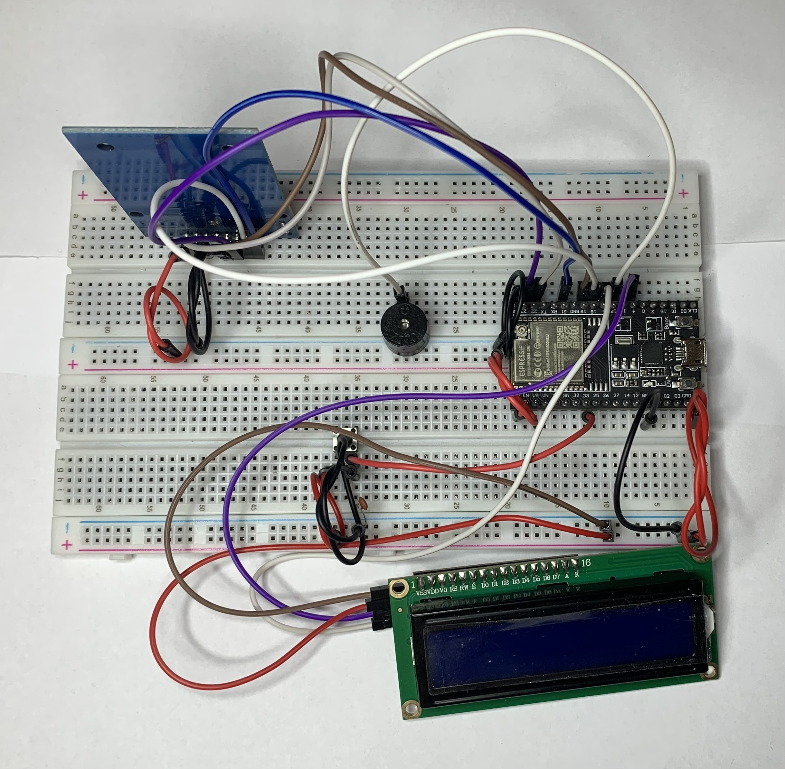
  <p><b>Fonte:</b> elaboração por Jinwar.</p>
</div>

&emsp;&emsp;Seguindo para o sensor da solução, sua função primordial é detectar a presença de um ID. Posteriormente, realiza a leitura das gravações, enviando essas informações de forma eficiente para a plataforma Ubidots. Por fim, o sistema exibe os dados de maneira adequada para o usuário, proporcionando uma experiência integrada e compreensível. Veja a seguir as fotos relacionadas a este protótipo e as informações apresentadas no Ubidots:

<div align="center">
  <p><b>Figura 30 - Sensor  do RFID</b></p>
  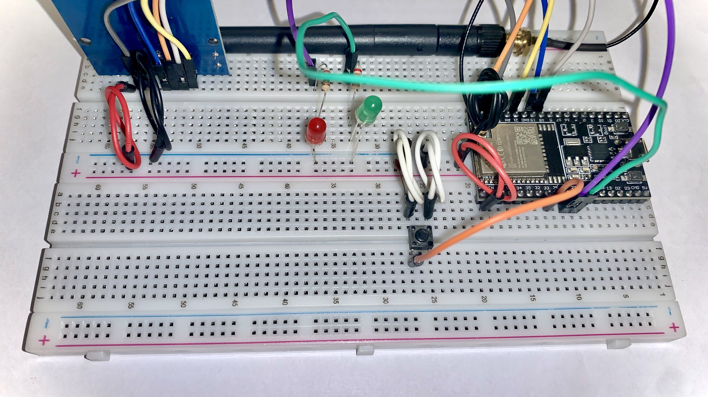
  <p><b>Fonte:</b> elaboração por Jinwar.</p>
</div>

<div align="center">
  <p><b>Figura 31 - Dashboard Ubidots</b></p>
  
  <p><b>Fonte:</b> elaboração por Jinwar.</p>
</div>

&emsp;&emsp;É importante ressaltar que todo o sistema utilizado pela solução está claramente detalhado no esquema UML apresentado na seção 3.4.4, onde é explicado o funcionamento de cada etapa. Veja a seguir os passos descritos no UML, relacionando a passagem do cliente por um sensor e posteriormente registrando as informações no Ubidots:

<div align="center">
  <p><b>Figura 32 - Uml Relacionado ao sensor</b></p>
  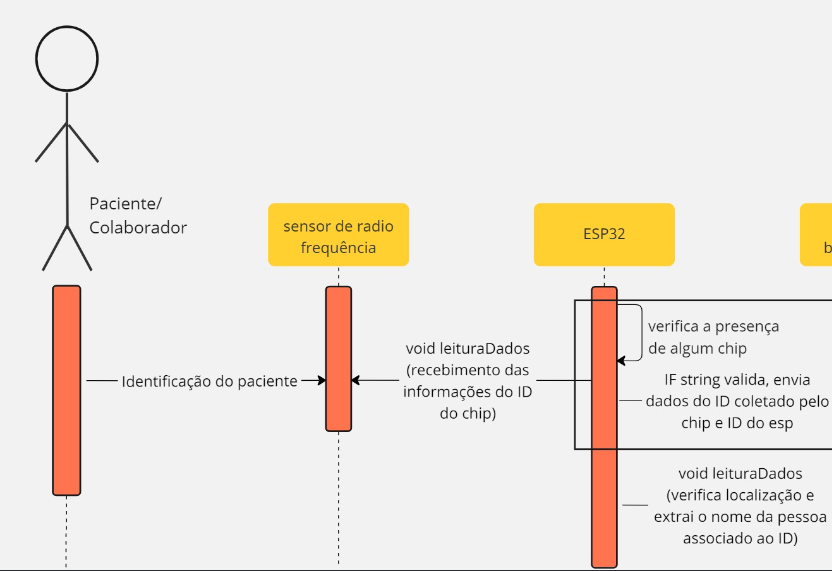
  <p><b>Fonte:</b> elaboração por Jinwar.</p>
</div>

&emsp;&emsp;A seguir, veja a parte do diagrama UML que se refere ao envio de dados para o Ubidots:

<div align="center">
  <p><b>Figura 33 - Uml Relacionado ao Ubidots</b></p>
  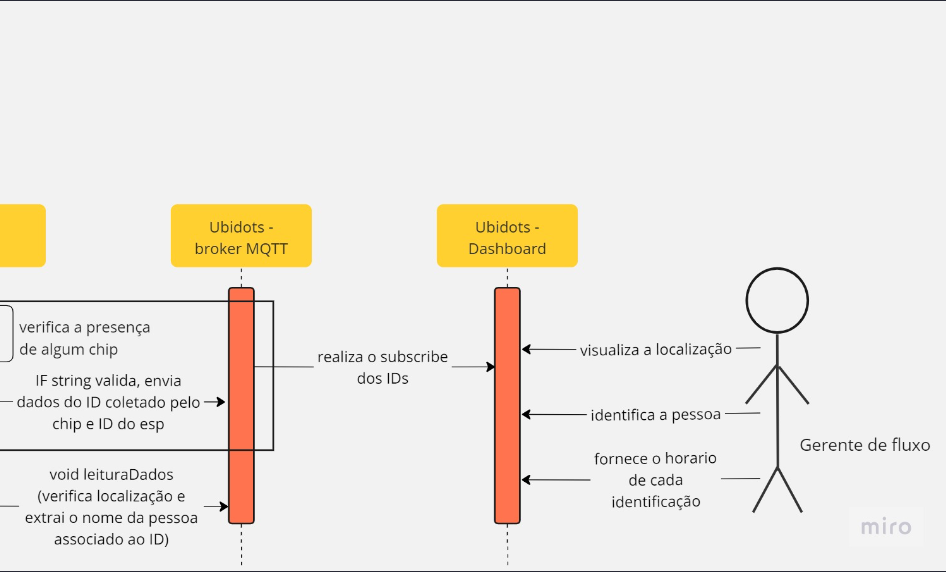
  <p><b>Fonte:</b> elaboração por Jinwar.</p>
</div>

&emsp;&emsp;Conclui-se então que ao longo do processo de prototipagem neste documento, a equipe Jinwar avançou até chegar a um estágio avançado do protótipo da solução, que incorpora o cadastro e o sensor de leitura, conforme definido na proposta do protótipo apresentada pelo parceiro. Você pode assistir ao vídeo que demonstra o funcionamento da solução nesta fase de desenvolvimento através deste <a href="https://youtu.be/W80r4j70KOY">Link</a>. Além disso, detalhes completos sobre o funcionamento da solução estão disponíveis no manual de instruções incluído no repositório atual.

### 3.4.6. Testes de Usabilidade

&emsp;&emsp;Para testar a solução Jinwar, foram feitos testes de guerrilha. Testes de Guerrilha é um método de pesquisa não convencional e rápido, usado para obter feedback sobre um produto, serviço ou ideia. Neste caso do projeto Jinwar, fizemos testes com 6 usuários diferentes no dia 13 de dezembro de 20223. A ideia foi testar se os usuários conseguiriam realizar pelo menos uma das tarefas que podem ser feitas com a solução. Foram estipulados 3 tarefas, sendo elas:

- Cadastrar paciente e consultar no ubidots;
- Reset do sistema e testar Tag;
- Consulta ao Manual;

&emsp;&emsp;O ambiente em que foram realizados esses testes foi controlado, todavia, com uma grande liberdade, tudo foi feito na faculdade Inteli - Instituto de Tecnologia e Liderança no endereço Av. Professor Almeida Prado, 520. Butantã, 05508-901. São Paulo – SP – Brasil.

&emsp;&emsp;Três integrantes do grupo Jinwar estavam presentes auxiliando nessa tarefa, sendo que enquanto dois davam instruções, um anotava e verificava o comportamento do usuário. Não houve controle de som, nem gravação de tela. Veja a seguir uma foto de onde foram realizados os testes.

<div align="center">
  <p><b>Figura 34 - Testes com usuários aleatórios</b></p>
  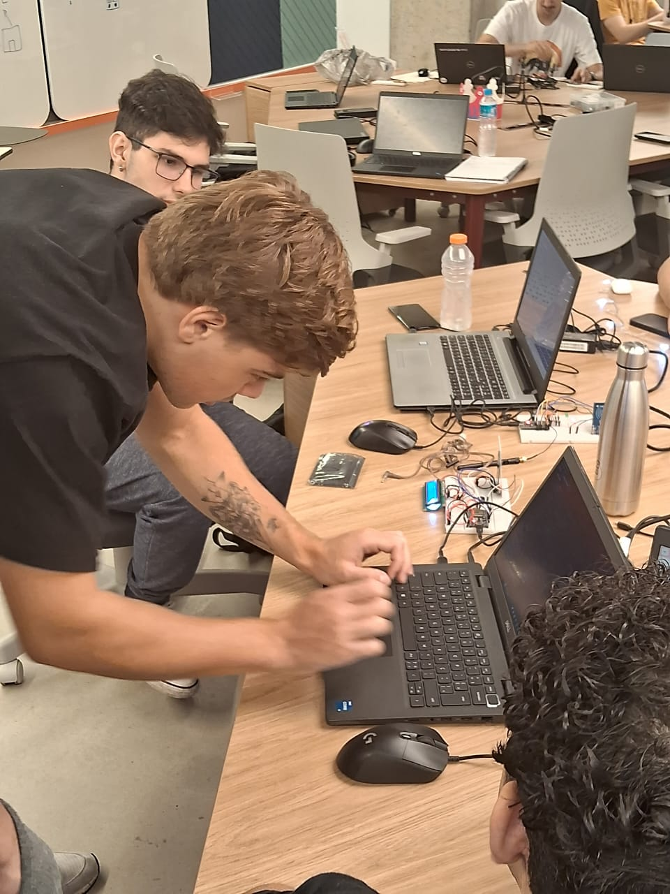
  <p><b>Fonte:</b> elaboração por Jinwar.</p>
</div>

&emsp;&emsp;Antes dos usuários, aleatoriamente selecionados, testarem o protótipo, eles recebiam uma pequena explicação sobre o projeto. Qual seria as personas envolvidas, sendo elas médico, controlador e paciente. Cada um desses usuários teve a chance de incorporar pelo menos uma persona e realizar a tarefa pedida. Mas, é preciso considerar que nesse teste de usabilidade, o público aleatório era da própria faculdade de tecnologia, e possuíam conhecimento prévio sobre IoT, ou seja, os testes foram feitos com o conhecimento de que podiam ser enviesados. Veja a seguir as anotações feitas durante os testes.

<div align="center">
  <p><b>Quadro 9</b>- Anotações de testes por tarefas</b></p>
  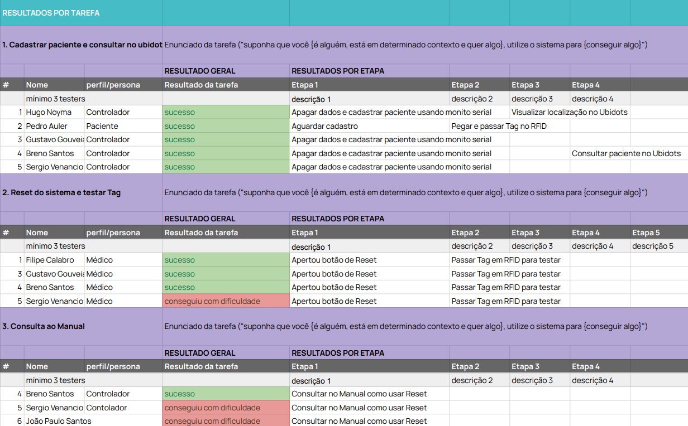
  <p><b>Fonte:</b> elaboração por Jinwar.</p>
</div>

 <div align="center">
  <p><b>Quadro 10</b>- Observações por tarefas dos testes</b></p>
  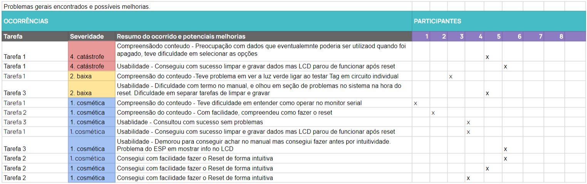
  <p><b>Fonte:</b> elaboração por Jinwar.</p>
</div>

&emsp;&emsp;Ao finalizar os testes, foram concluídos alguns pontos cruciais para o aprimoramento do projeto, visando estar ainda mais próximo do cotidiano do usuário que utilizará o projeto no Hospital. Analisando então as anotações das duas imagens acima, pode-se ver muitos pontos de melhora.

&emsp;&emsp;Os testes de guerrilha revelaram problemas significativos na compreensão do conteúdo e na usabilidade do protótipo. A dificuldade em entender a operação do monitor serial e a falta de orientação para os próximos passos após erros serem identificados. Além disso, a terminologia utilizada no processo, como 'limpar' ou 'excluir', causou confusão e preocupação quanto à perda permanente de dados.

&emsp;&emsp;Uma melhoria essencial seria aprimorar o monitor serial para oferecer orientações após eventos de erro, indicando ações corretivas ou sugestões sobre os próximos passos. Além disso, fornecer uma documentação detalhada sobre o funcionamento de cada componente seria valioso para ajudar os usuários a identificar rapidamente problemas específicos.
A revisão da terminologia utilizada no sistema também é recomendada, optando por termos menos definitivos, como 'redefinir' ou 'desativar temporariamente', para evitar confusões sobre ações que podem resultar em perda de dados.

&emsp;&emsp;Além disso, simplificar o processo com a tag, reduzindo a necessidade de repetições, e aperfeiçoar o software para evitar bugs e travamentos são passos críticos. Isso envolve testes extensivos do código, identificação precoce de problemas por meio de práticas de desenvolvimento ágil e integração contínua para implementação rápida de soluções.
De todo modo, todos os usuários que testaram conseguiram realizar as tarefas propostas pela solução, e poucos tiveram dificuldade. Tanto o Hardware, que é a parte física da solução, quando o manual e instruções dadas no monitor serial são operaveis. Com os testes, se tem um direcionamento dos próximos passos, que incluem aprimorar a orientação do monitor serial, detalhar o funcionamento dos componentes, ajustar a terminologia utilizada, simplificar a interação com a tag e aprimorar o software por meio de testes e práticas de desenvolvimento ágil para garantir um produto mais estável e amigável aos usuários.

&emsp;&emsp;Link do Sheets para visualização ou aproveitamento de templete: https://docs.google.com/spreadsheets/d/1hLHTSWM5h5iWO6fP3iAwwI3D0l9heOKv99UHMXaKr38/edit?usp=sharing

## <a name="c4"></a>4. Possibilidades de Descarte

&emsp;&emsp;A produção da solução Jinwar levanta uma questão importante: a problemática do lixo eletrônico. Ela abrange uma série de aspectos, desde os riscos à saúde até os impactos ambientais decorrentes de seu descarte inadequado. A quantidade crescente de resíduos eletrônicos, proveniente tanto do consumo exacerbado quanto da rápida obsolescência desses produtos, levanta questões cruciais sobre os danos que podem causar ao planeta e à saúde pública. Por isso, é importante pensar nas possibilidade de descarte desses materiais, levando em consideração seus riscos potenciais à saúde e ao meio ambiente, já que a maior parte desses materiais possui um tempo de vida útil longo.

&emsp;&emsp;Ao documentar os impactos ambientais causados pelo descarte inadequado de resíduos eletrônicos, foi-se baseado em diversas fontes confiáveis que destacam as consequências nefastas desse tipo de poluição. Entre elas, os estudos de Ecoassist (Ecoassist.com.br)²¹, que elucidam os impactos gerais do lixo eletrônico no nosso ecossistema, evidenciando a extensão dos danos ao solo, à água e à saúde humana.
As análises detalhadas realizadas por Thalita Ferreira (Matanativa.com.br)²² foram essenciais para compreender os efeitos nocivos específicos dos resíduos eletrônicos na saúde, incluindo problemas respiratórios, riscos cancerígenos e impactos diretos na fauna e flora.

&emsp;&emsp;Além disso, o artigo de Alejandra Martins (BBC News Brasil)²³ trouxe à tona a preocupação com os metais pesados presentes nesses resíduos, destacando seu impacto duradouro na saúde de crianças no Brasil e em todo o mundo, mesmo décadas após sua proibição. Diversos autores falam da vida útil estimada dos compostos com grande amplitude e valores diferentes. Seguindo as fontes já mencionadas e com auxílio da IA Chat GPT se estipulou um intervalo de vida útil para cada componente.

### Materiais Utilizados

&emsp;&emsp;Os materiais utilizados no projeto são:

- **Jumpers:** Fios condutores usados para fazer conexões elétricas entre componentes em um circuito.
- **LCD:** Tela que exibe informações visuais.
- **Tag:** Dispositivo de identificação por radiofrequência (RFID) que armazena informações que podem ser lidas por um leitor RFID.
- **ESP32:** Microcontrolador que pode ser usado para conectar sensores de gerenciamento de resíduos, otimizar rotas de coleta de resíduos e monitorar processos de reciclagem.
- **Protoboard:** Placa para prototipagem que facilita a criação de projetos eletrônicos porque dispensa o uso de solda para testar circuitos.
- **RFID - RC522:** Módulo que permite a leitura de certos cartões (tags) apenas pela aproximação dos mesmos.
- **Antena Wifi 2.4ghz:** Antena que opera na frequência de 2,4 GHz, usada para transmitir sinais de Wi-Fi.
- **Bateria RFID(Lítio):** Bateria utilizada nas tags ativas de RFID que permite alcance maior que as tags passivas.
- **LED 5mm:** Um diodo emissor de luz (LED) de 5mm é um componente eletrônico que emite luz quando uma corrente elétrica passa por ele.
- **Capacitor de cerâmica 10nF/50V:** Um capacitor de cerâmica com uma capacidade de 10 nanofarads e tensão máxima de 50 volts.
- **Resistores de 220Ω:** Os resistores de 220 ohms são componentes eletrônicos usados para limitar o fluxo de corrente em um circuito. Eles têm uma resistência de 220 ohms, o que significa que limitam a quantidade de corrente que passa por eles.

&emsp;&emsp;Esses componentes eletrônicos, em sua maioria, possuem materiais tóxicos como chumbo, mercúrio e cádmio, que, quando descartados de forma incorreta, apresentam potencial para contaminar os solos, os lençóis freáticos e a vida selvagem. Os riscos à saúde humana também são significativos, podendo desencadear desde sintomas imediatos até complicações crônicas por intoxicação. É essencial compreender que a destinação correta desses resíduos é crucial para mitigar efeitos nocivos.

### Método de descarte

&emsp;&emsp;Os métodos de descarte para cada material são:

- **Jumpers:** Estes componentes, compostos por metal e plástico, têm uma vida útil média variável conforme o ambiente e uso. Para prolongar sua vida útil, é recomendável utilizar em ambientes controlados e com manuseio cuidadoso. Após seu ciclo de uso, considerar a reciclagem em centros especializados em eletrônicos, onde podem ser separados e processados de forma apropriada.
- **Telas LCD:** Projetadas para durar entre 5 a 10 anos, o cuidado com a exposição a temperaturas extremas e umidade é crucial para prolongar sua vida útil. No fim do ciclo de vida, encaminhá-las para centros de reciclagem específicos para eletrônicos é a melhor opção, evitando assim a contaminação ambiental por seus materiais.
- **Tags RFID:** Dependendo do uso e tipo, essas tags podem ter uma expectativa de uso de até 10 anos. Em ambientes agressivos, essa expectativa pode diminuir. Para o descarte responsável, direcioná-las para instalações de reciclagem eletrônica é recomendado, evitando que componentes tóxicos ou materiais potencialmente poluentes sejam descartados de forma inadequada.
- **ESP32 e RFID - RC522:** Antes de descartar, é preciso remover baterias e outros componentes perigosos se existirem. Encaminhe-os para instalações de reciclagem de eletrônicos especializadas, onde serão processados com segurança, evitando impactos adversos ao meio ambiente e à saúde.
- **Protoboard e Antena Wifi 2.4GHz:** Para o descarte adequado desses itens, reciclar em centros especializados em eletrônicos. Verificar programas de retorno e reciclagem oferecidos pelos fabricantes também pode ser uma opção válida, permitindo que os materiais sejam reutilizados ou processados de forma responsável.
- **Bateria de Tag Ativa de RFID:** As baterias das tags ativas de RFID devem ser atenciosamente descartadas, pois podem conter substâncias tóxicas prejudiciais ao meio ambiente se descartadas incorretamente. Recomenda-se a separação das baterias das tags antes do descarte. Dirija-se a instalações de reciclagem de baterias ou centros de reciclagem de eletrônicos, onde as baterias podem ser processadas de maneira apropriada e segura, evitando a liberação de substâncias perigosas no meio ambiente. Algumas empresas de reciclagem de eletrônicos também podem aceitar baterias separadamente, garantindo seu tratamento adequado e prevenindo danos ambientais.
- **LEDs 5mm:** É recomendável separar os componentes eletrônicos dos materiais não recicláveis, como plástico, antes do descarte. Encaminhe os \*LEDs usados para centros de reciclagem eletrônica especializados, onde poderão ser desmontados e processados adequadamente para a recuperação de materiais valiosos.
- **Capacitores de cerâmica:** contêm materiais como cerâmica, metal e outros componentes. Para descartá-los de forma responsável, é importante separar esses materiais. Encaminhe-os para instalações de reciclagem de eletrônicos ou centros de reciclagem especializados, onde poderão ser tratados adequadamente para a recuperação de materiais ou disposição final segura.
- **Resistores:** Separe os resistores usados para centros de reciclagem de eletrônicos, onde poderão ser processados adequadamente para a recuperação de materiais e tratamento seguro.

&emsp;&emsp;Esses métodos de descarte são importantes e uma boa prática a ser seguida. Investimentos em práticas como estas estimulam uma economia circular e são benéficas não só para o hospital mas para todo o planeta. Eventualmente, por exemplo, os fornecedores das baterias podem ter uma política de desconto quando se retorna as baterias já utilizadas. Ajudando assim na reutilização, reparação e reciclagem desses produtos.

&emsp;&emsp;Além disso, é crucial considerar os riscos envolvidos no descarte inadequado de materiais como jumpers, LCDs e tags RFID. A disposição incorreta desses componentes pode levar à lixiviação de substâncias tóxicas para o solo e a água. Elementos como chumbo nos jumpers e mercúrio nos LCDs apresentam potencial para causar danos severos ao meio ambiente. Esses poluentes podem impactar negativamente os ecossistemas aquáticos, reduzir a biodiversidade e contaminar fontes de água potável, representando uma ameaça significativa à saúde animal.

&emsp;&emsp;É crucial, portanto, garantir a manutenção adequada desses equipamentos para minimizar tais riscos. O controlador, representado por Rafael Souza(abordado na seção 3.2.1. Personas), desempenhará um papel fundamental nesse processo, gerenciando a manutenção periódica dos equipamentos a cada 3 anos em colaboração com a Garagem de Tecnologia do Hospital Sírio Libanês. Essa parceria garantirá não apenas o bom funcionamento dos dispositivos, mas também a redução dos impactos ambientais e a preservação da qualidade dos serviços oferecidos aos pacientes, alinhando-se às expectativas elevadas do público que busca atendimento diferenciado no hospital.Veja a seguir a seção de vida útil desses materiais abordados.

### Vida útil

&emsp;&emsp;A vida útil desses materiais varia dependendo do uso e do ambiente. No entanto, é importante notar que todos esses materiais podem ser reciclados no final de sua vida útil.Veja a seguir uma estimativa da vida útil desses materiais no quadro 9.

<div align="center">
  <p><b>Quadro 11</b> - Materiais e estimativa da vida útil</b></p>

| Materiais                      | Vida Útil Estimada                      | Risco de Descarte Incorreto                                                                      |
| ------------------------------ | --------------------------------------- | ------------------------------------------------------------------------------------------------ |
| Jumpers                        | 3-5 anos (uso moderado)                 | Poluição do solo e da água com metais pesados.                                                   |
| LCD                            | 5-10 anos (dependendo do uso)           | Liberação de mercúrio e outros metais pesados.                                                   |
| Tag RFID (Passiva)             | Até 10 anos (condições normais)         | Poluição eletrônica, risco de vazamento de dados.                                                |
| Tag RFID (Ativa)               | 3-5 anos (devido à bateria interna)     | Poluição por baterias e componentes eletrônicos.                                                 |
| ESP32                          | 5-8 anos (uso padrão)                   | Contaminação por substâncias químicas em circuitos.                                              |
| Protoboard                     | 5-10 anos (uso controlado)              | Poluição por plásticos e metais.                                                                 |
| RFID - RC522                   | 4-7 anos (uso regular)                  | Poluição eletrônica, componentes químicos nocivos.                                               |
| Antena Wifi 2.4ghz             | 6-8 anos (uso padrão)                   | Poluição por metais e plásticos, riscos à saúde.                                                 |
| LEDs (Light Emitting Diode)    | Aproximadamente 50,000 horas (5-6 anos) | Presença de materiais tóxicos como chumbo e arsênio, impactos ambientais como no solo e na água. |
| Capacitor de cerâmica 10nF/50V | 3-5 anos (uso moderado)                 | Poluição por metais e contaminação de solos.                                                     |
| Resistores de 220Ω             | 3-5 anos (uso moderado)                 | Contêm elementos metálicos, apresentando riscos à saúde.                                         |

  <p><b>Fonte:</b> elaboração por Jinwar.</p>
</div>

&emsp;&emsp;Estudos revelam que aproximadamente 40%²³ do chumbo encontrado em aterros sanitários é proveniente do descarte inadequado de eletrônicos. A contaminação de lençóis freáticos por metais pesados resultantes do descarte incorreto desses dispositivos é um problema recorrente e alarmante. Um exemplo marcante é a presença de mercúrio proveniente de LCDs, cujo acúmulo na cadeia alimentar afeta diretamente a saúde dos peixes e, consequentemente, a saúde humana.

&emsp;&emsp;A disposição inadequada desses materiais pode resultar na poluição do solo e da água devido à presença de metais e plásticos capazes de liberar substâncias tóxicas no ambiente. Portanto, é necessário assegurar que esses materiais sejam descartados corretamente, direcionando-os para instalações de reciclagem apropriadas. Essa prática não apenas evita danos ambientais significativos, mas também contribui para a preservação dos ecossistemas e da saúde pública.

## <a name="c5"></a>5. Conclusões e Recomendações

### **Recomendações:**


**Manual de Instruções Abrangente:** 
- Garantir que o manual de instruções seja completo e fácil de acessar. Entre em contato para suporte técnico em caso de falhas. Toda atualização e implementação de novas tecnologias devem ser documentadas no manual.

**Continuidade das Metodologias Ágeis:**
- Recomendamos continuar adotando metodologias ágeis, principalmente o Scrum alinhado com Lean Inception e RMO-DP para manter a eficiência e flexibilidade no desenvolvimento e implementação.

**Uso de Protocolos Criptográficos:**
   - **AES (Advanced Encryption Standard):** É um dos algoritmos de criptografia mais utilizados para proteger dados. Ele pode ser aplicado para criptografar os dados antes de serem transmitidos pela tag RFID e decodificados apenas pelos dispositivos autorizados.
   - **ECC (Elliptic Curve Cryptography):** É uma alternativa eficiente em termos de recursos para a criptografia. Oferece um nível robusto de segurança e é especialmente adequada para ambientes com recursos limitados, como dispositivos RFID.

**Implementação de Chaves de Criptografia:**
   - A comunicação entre a tag RFID e os leitores pode ser protegida usando chaves criptográficas. A tag e o leitor devem compartilhar uma chave de criptografia para criptografar e descriptografar os dados dos pacientes e corpo hospitalar.
   - O uso de chaves dinâmicas ou rotativas aumenta a segurança, já que as chaves são alteradas regularmente, dificultando a decodificação por possíveis invasores.

**Autenticação e Controle de Acesso:**
   - Além da criptografia, é crucial implementar um sistema robusto de autenticação e controle de acesso. Isso pode envolver a verificação da identidade das tags RFID e dos dispositivos leitores para garantir que apenas dispositivos autorizados possam acessar os dados.

**Gerenciamento de Chaves:**
   - O gerenciamento adequado das chaves criptográficas é essencial. Isso inclui a geração segura de chaves, a distribuição segura das chaves para os dispositivos relevantes e a rotação periódica das chaves para manter a segurança.

**Proteção contra Ataques:**
   - Considerar medidas de segurança contra ataques como replay attacks, man-in-the-middle attacks e outros ataques de criptoanálise.
   - A implementação de checksums ou hash codes para verificar a integridade dos dados pode ajudar a detectar possíveis modificações não autorizadas.

**Implementação de Modo de Economia de Energia:** 
- Considerar a aplicação de modo de "deep sleep" para os ESPs a fim de otimizar o consumo de energia e prolongar a vida útil dos dispositivos.

**Integrar com prontuário eletrônico:** 
- Aproveitar da tecnologia existente no hospital e integrar com a solução Jinwar, evitando a criação de um sistema subalterno que pode ser encarecido com implementação não necessária.

**Patenteação do modelo melhorado:** 
- Patentear modelo que pode gerar lucro para o Hospital Sírio-Libanês e salvar vidas em múltiplos pontos hospitalares.

**Possível aplicação com RFID ativo:**
- Aplicar solução com uma Tag ativa alimentada a bateria, garantindo um maior alcance da solução.

**Funcionalidade de Emergência:**
- Adicionar sistema automático para priorização de atendimento para pacientes de emergência.

**Aplicação de Machine Learning:**
- Com os dados dos pacientes, é possível aplicar modelos de Machine Learning para analisar possíveis melhorias mais estratégicas nos hospitais de forma otimizada, levando em conta um grande volume de pacientes.

&emsp;&emsp;Essas estratégias integradas são fundamentais para garantir a segurança dos dados transmitidos pelas tags RFID, protegendo o hospital  contra acessos não autorizados e assegurando a transmissão e armazenamento seguros. A escolha do método de criptografia para o sistema RFID deve considerar a implementação específica e a compatibilidade com os dispositivos existentes.

&emsp;&emsp;A solução Jinwar foi desenvolvida com o objetivo principal de aprimorar a eficiência e precisão na alocação da equipe assistencial e dos pacientes, resultando em redução significativa no tempo de resposta e melhoria na qualidade do atendimento. As recomendações propostas aumentam consideravelmente o potencial de eficiência do MVP (Produto Mínimo Viável).

&emsp;&emsp;A abordagem adotada foi cuidadosamente pensada, levando em conta não apenas a viabilidade técnica, mas também a adaptabilidade e adequação ao ambiente hospitalar. Isso garante uma implementação eficaz e escalável, permitindo a melhoria imediata, capacidade de adaptação e expansão conforme as necessidades evoluem.

### **Conclusões:**
&emsp;&emsp;Jinwar demonstrou resultados significativos e um potecial futuro de sucesso para o Hospital Sírio-Libanês, oferecendo uma solução tecnologicamente simples e econômica. A implementação de RFID permitiu uma identificação precisa de pessoas, locais e tempos, permitindo a melhora da eficiência operacional.

&emsp;&emsp;Esta solução também se mostrou escalável, capaz de expandir-se conforme as necessidades do hospital crescem. Além disso, destaca-se por sua capacidade de cumprir o escopo de identificação de forma precisa e confiável.

&emsp;&emsp;Destaca-se o valor agregado à instituição com a melhoria da eficiência operacional, redução de custos e, principalmente, aprimoramento da qualidade do atendimento ao paciente. A interface do Dashboard, desenvolvida em conjunto com o message broker Ubidots, em total alinhamento com o hardware da solução, foi avaliada como sutil e altamente operacional durante os testes de guerrilha descritos na seção 3.4.6 - Testes de Usabilidade. Estes resultados ratificaram a capacidade da interface em atender a todos os requisitos estabelecidos no objetivo do projeto na seção 1.1 - Objetivos. 


## <a name="c6"></a>6. Referências

1. ROCHA, YB. **Jinwar: a vila criada por e para mulheres no Curdistão.** 18 maio 2018. Disponível em: https://www.brasildefato.com.br/2018/05/10/jinwar-a-vila-criada-por-e-para-mulheres-no-curdistao. Acesso em: 23 out. 2023.

2. LUIZ, Jonathan. **Hospitais particulares que não prestam atendimento emergencial comentem crime.** 5 out. 2020. Disponível em: https://www.correiobraziliense.com.br/cidades-df/2020/10/4880013-direito-do-consumidor.html. Acesso em: 23 out. 2023.

3. CASAROTTO, C. (2020, 11 de dezembro). **As 5 forças de Porter: quais são elas e como entender o conjunto de fatores que influenciam no sucesso do seu negócio? rockcontent.** Disponível em: https://rockcontent.com/br/blog/5-forcas-de-porter/
   Acesso em: 24 out. 2023.

4. .RAEBURN, A. (2022, 28 de novembro). **Análise SWOT/FOFA: o que é e como usá-la (com exemplos).** asana. Disponível em: https://asana.com/pt/resources/swot-analysis?gclid=CjwKCAjww7KmBhAyEiwA5-PUStFYfdjQk1NDB65i4CO2FKSIh7XsE-8s6JXOQBSOJ6NEsmQlpH90_xoChhkQAvD_BwE&amp;gclsrc=aw.ds Acesso em: 22 out. 2023.

5. SOFTWARE, Lucid. **Redirecting**. Disponível em: https://www.lucidchart.com/pages/pt/o-que-e-analise-swot. Acesso em: 24 out. 2023.

6. OSTERWALDER, A.; PIGNEUR, Y.; BERNARDES, G.; SMITH, **A. Value Proposition Design: How to Create Products and Services Customers Want. New Jersey: Wiley, 2014.4**. Acesso em: 24 out. 2023.

7. ESFERA ENERGIA. (2022, 14 de outubro). **Matriz de risco: o que é, quando usar e como montar uma tabela**. esferablog. Disponível em: https://blog.esferaenergia.com.br/gestao-empresarial/matriz-de-risco. Acesso em: 25 out. 2023.

8. ALBERTACCI, Laura. **Devo me preocupar com a LGPD?** Jus.com.br. Disponível em: https://jus.com.br/artigos/91636/devo-me-preocupar-com-a-lgpd. Acesso em: 18 out. 2023.

9. SÍRIO-LIBANÊS, Hospital. **Hospital Sírio Libanês**. 8 fev. 2021. Disponível em: https://hospitalsiriolibanes.org.br/politica-de-privacidade/. Acesso em: 18 out. 2023.

10. Salminen, J., Nielsen, L., Bahloul, M. et al. **Persona preparedness: a survey instrument for measuring the organizational readiness for deploying personas.** Inf Technol Manag (2022). Disponível em: https://doi.org/10.1007/s10799-022-00373-9 Acesso em: 19 out. 2023.

11. SIQUEIRA, A. (2022, 14 de fevereiro). **Persona: o que é, como definir e por que criar uma para sua empresa [+ exemplos práticos e um gerador].** Resultados Digitais. Disponível em: https://resultadosdigitais.com.br/marketing/persona-o-que-e/#:~:text=O%20que%20é%20persona?,,%20objetivos,%20desafios%20e%20preocupações. Acesso em: 25 out. 2023.

12. SÍRIO-LIBANÊS, Hospital. **Hospital Sírio-Libanês**. Disponível em: https://www.hospitalsiriolibanes.org.br/encontre-seu-medico/. Acesso em: 19 out. 2023.

13. SAÚDE, Portal Setor. **A definição de valor em saúde do Sírio-Libanês e os desafios dos setores público e privado - Setor Saúde.** 7 maio 2019. Disponível em: https://setorsaude.com.br/a-definicao-de-valor-em-saude-do-sirio-libanes-e-os-desafios-dos-setores-publico-e-privado/. Acesso em: 19 out. 2023.

14. SÍ­RIO-LIBANÊS, Hospital. **Hospital Sí­rio-Libanês.** Disponível em: https://www.hospitalsiriolibanes.org.br/especialidades-medicas/sao-paulo/hernia-e-parede-abdominal/. Acesso em: 19 out. 2023.

15. BRASIL, Hospitais. **Sírio-Libanês cria nova marca para fomentar tecnologia, dados e inovação na saúde e ensino.** 16 dez. 2022. Disponível em: https://portalhospitaisbrasil.com.br/sirio-libanes-cria-nova-marca-para-fomentar-tecnologia-dados-e-inovacao-no-setor-de-saude-e-ensino/. Acesso em: 19 out. 2023.

16. SÍRIO-LIBANÊS, **Hospital. Experiência Sírio-Libanês | Sírio-Libanês Ensino e Pesquisa.** Disponível em: https://iep.hospitalsiriolibanes.org.br/experiencia-sirio-libanes. Acesso em: 19 out. 2023.

17. SÍRIO-LIBANÊS, Hospital. **Especialização em Experiência do Paciente e Cuidado Centrado na Pessoa | Hospital Sírio-Libanês.** Disponível em: https://iep.hospitalsiriolibanes.org.br/cursos-pos-graduacao/especializacao-em-experiencia-do-paciente-e-cuidado-centrado-na-pessoa. Acesso em: 26 out. 2023.

18. GIBBONS, Sarah. **Journey Mapping 101.** 9 dez. 2018. Disponível em: https://www.nngroup.com/articles/journey-mapping-101/. Acesso em: 24 out. 2023.

19. TEAM, Vyond. **What Is A Storyboard & How Do You Create One? (With Video)**. 11 jan. 2023. Disponível em: https://www.vyond.com/resources/what-is-a-storyboard-and-why-do-you-need-one/. Acesso em: 19 out. 2023.

20. ARRUDA, Ricardo. **O que são User Stories (Estórias de Usuário)? - Agile Expert**. 14 maio 2021. Disponível em: https://www.agilexpert.com.br/2021/05/14/o-que-sao-user-stories-historias-de-usuario/. Acesso em: 25 out. 2023.

21. ECOASSIT. **Quais impactos o lixo eletrônico causa no planeta?** - Ecoassist. Disponível em: https://ecoassist.com.br/quais-impactos-o-lixo-eletronico-causa-no-planeta/. Acesso em: 30 nov. 2023.

22. FERREIRA, Thalita.**Quais são os impactos dos resíduos Eletrônicos no Meio Ambiente.** 15 set. 2022. Disponível em: https://matanativa.com.br/impactos-dos-residuos-eletronicos-no-meio-ambiente/#:~:text=Efeitos%20nocivos%20à%20saúde%20humana,de%20pulmão;%20e%20câncer%20linfático. Acesso em: 30 nov. 2023.

23. MARTINS, Alejandra. **O metal pesado tóxico que afeta crianças no Brasil e no mundo décadas após proibição - BBC News Brasil.** 20 jul. 2021. Disponível em: https://www.bbc.com/portuguese/geral-57886448. Acesso em: 5 dez. 2023.
